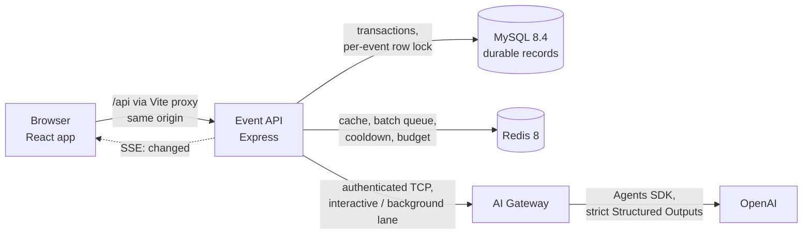

# Event Desk

A coordinator tool for **Harbour Community Club**. It keeps a reliable attendance record for an ended event and turns short, anonymous feedback notes into an evidence-backed briefing: **what happened, which themes recur, where people disagree, and what might be worth following up.** The coordinator inspects every cited note, edits the wording, and saves it. Saved human work is never overwritten by a new generation.

This build serves one seeded event, **E101 · Saturday Walk**, with four registered members (Alex, Bea, Chris, Drew) and eight supplied notes (F01–F08), as specified in the [project brief](docs/project-brief.md).

| Part                | What it is                                                                                                |
| ------------------- | --------------------------------------------------------------------------------------------------------- |
| `apps/web`          | React coordinator app (and a test feedback form)                                                          |
| `apps/event-api`    | Node.js/Express API: attendance, briefings, generation, batches, live updates                             |
| `apps/ai-gateway`   | The only process that talks to OpenAI; called by the event API over an authenticated local TCP connection |
| MySQL 8.4 · Redis 8 | Durable records · cache, batch queue, cooldown and budget (Docker Compose)                                |

## Quick start

**You need:** Node.js 24 (see `.nvmrc`), pnpm 11 (`corepack enable` picks the pinned version), Docker with Compose, and — only for AI generation — an OpenAI API key.

```bash
corepack enable               # once: activates the pinned pnpm
pnpm install
cp .env.example .env          # local-only defaults; add OPENAI_API_KEY to enable generation
pnpm infra:up                 # MySQL 8.4 and Redis 8 on 127.0.0.1
pnpm dev                      # AI Gateway, event API and web app together
```

Open **http://localhost:5173**. On a fresh database it opens E101 with the brief's starting counts: 4 registered · 1 attended · 2 absent · 1 not recorded.

- The first start of the event API creates the schema and seeds E101 once. Later starts keep everything you saved.
- Adding the OpenAI key later? Restart `pnpm dev` (the apps read `.env` at startup).
- **Without an OpenAI key** everything works except generation: Generate answers "The AI service has no provider configured", and nothing you saved changes.
- **Without the AI Gateway running** Generate answers that the AI service is not reachable; the rest of the app is unaffected.
- The test feedback form is at **http://localhost:5173/events/E101/feedback** (also linked from the Feedback panel as "Open feedback form (test)").

## Using it: the coordinator flow

| The brief's outcome         | What to do in the app                                                                                                                                                                                                                                                                                                                                                                                                                                       |
| --------------------------- | ----------------------------------------------------------------------------------------------------------------------------------------------------------------------------------------------------------------------------------------------------------------------------------------------------------------------------------------------------------------------------------------------------------------------------------------------------------- |
| **Record attendance**       | Change a member's status. The counts update at once, labelled unsaved; **Save attendance** stores them. A change saved in another tab is detected (you get a conflict, not a silent overwrite). Saved records survive refresh and restart.                                                                                                                                                                                                                  |
| **Review feedback**         | The Feedback panel lists each note with its stable ID (F01…). Notes are read-only and not linked to members.                                                                                                                                                                                                                                                                                                                                                |
| **Generate an AI briefing** | **Generate briefing** (available once attendance changes are saved or discarded) calls the model through the AI Gateway and opens the result as a **generated preview** (if the editor has no unsaved text). The briefing answers the four questions: _What happened_ (a code-built attendance overview plus a cited feedback summary), _Which themes recur_, _Where people disagree_, _What might be worth following up_. Every item shows its source IDs. |
| **Inspect and edit**        | **Read source F05** opens the cited note inline. Edit the wording of any item (structure and references stay fixed), then **Save briefing** — or **Save and replace briefing** when a saved briefing already exists.                                                                                                                                                                                                                                        |
| **Keep work trustworthy**   | Save an attendance change and the briefing says **"Out of date — attendance changed since this briefing was generated"**, naming the change ("Chris: Not recorded → Attended"). Generating again creates a separate preview; only an explicit save replaces your saved briefing. Failures are shown in words, and your text is kept.                                                                                                                        |

**Beyond the brief (confirmed extensions):** new notes can be added through the test feedback form or `pnpm feedback:simulate`. Notes that arrive close together are batched (a fixed 3-second window) into **one** automatic generation, which appears as "New automatic briefing ready to review." and never disturbs your editor or your own Generate. The page updates live; notes from the form or script appear without a reload.

## Commands

| Command                             | What it does                                                                                                                                                                                                                                                                                      |
| ----------------------------------- | ------------------------------------------------------------------------------------------------------------------------------------------------------------------------------------------------------------------------------------------------------------------------------------------------- |
| `pnpm dev`                          | AI Gateway (127.0.0.1:4100, TCP), event API (http://127.0.0.1:4000) and web app (http://localhost:5173; Vite proxies `/api` to the API); backend logs print as one readable line each (pino-pretty), JSON everywhere else                                                                         |
| `pnpm infra:up` / `pnpm infra:down` | Start / stop MySQL and Redis (Docker Compose, loopback ports)                                                                                                                                                                                                                                     |
| `pnpm db:reset`                     | Explicit reset — see [Resetting the data](#resetting-the-data)                                                                                                                                                                                                                                    |
| `pnpm feedback:simulate`            | Posts test notes to the running API: `--count 5 --interval-ms 200 [--text-file notes.txt]`. A burst inside one window makes one automatic briefing (one paid call with a real key)                                                                                                                |
| `pnpm verify`                       | Prettier, ESLint, type-check, architecture rules (dependency-cruiser) and unit tests                                                                                                                                                                                                              |
| `pnpm test`                         | Unit tests only (Vitest)                                                                                                                                                                                                                                                                          |
| `pnpm test:integration`             | Integration tests against the `event_desk_test` database and Redis DB 1 (needs `pnpm infra:up`)                                                                                                                                                                                                   |
| `pnpm e2e`                          | Playwright end-to-end tests on their own ports (4010, 4199, 5183), against `event_desk_test` and Redis DB 2, with a scripted fake AI Gateway (needs `pnpm infra:up` and `pnpm --filter @event-desk/e2e exec playwright install chromium`); don't run it at the same time as the integration tests |
| `pnpm smoke:live`                   | Manual real-model check through the running Gateway (needs a key); `--hostile` adds a prompt-injection note. Never run in CI                                                                                                                                                                      |
| `pnpm build`                        | Compiles the Node packages and builds the web bundle                                                                                                                                                                                                                                              |

## Configuration

All settings come from environment variables. `.env.example` lists every one with local-only defaults; copy it to `.env`. Each app reads **only its own** keys from `.env`, so the event API never receives the OpenAI key (keep it in `.env` rather than exporting it in your shell). Invalid values stop the app at startup with a message naming the variable.

| Variable                                                          | Default                                               | Used by               | Meaning                                                                                                                          |
| ----------------------------------------------------------------- | ----------------------------------------------------- | --------------------- | -------------------------------------------------------------------------------------------------------------------------------- |
| `OPENAI_API_KEY`                                                  | (empty)                                               | Gateway               | Enables generation. Empty → Generate answers "no provider configured"                                                            |
| `OPENAI_MODEL`                                                    | `gpt-5-mini` (set in `.env.example`)                  | Gateway               | Model used for generation; required when a key is set                                                                            |
| `GATEWAY_SERVICE_SECRET`                                          | local-only value                                      | API, Gateway          | Shared secret for the internal TCP calls (≥ 32 bytes; generate one with `openssl rand -hex 32` for anything beyond your machine) |
| `MYSQL_URL` / `REDIS_URL`                                         | local Compose services                                | API                   | Durable store / cache, queue and limits                                                                                          |
| `PORT` / `GATEWAY_PORT`                                           | `4000` / `4100`                                       | API / API and Gateway | Ports of the event API / the AI Gateway (both bind to loopback only)                                                             |
| `ALLOWED_ORIGINS` / `ALLOWED_HOSTS`                               | `http://localhost:5173` / `localhost,127.0.0.1,[::1]` | API                   | Origins allowed to change data (cross-origin changes are rejected) / hosts accepted on every request                             |
| `BRIEFING_BATCH_WINDOW_MS`                                        | `3000`                                                | API                   | Fixed batch window for automatic briefings                                                                                       |
| `GENERATION_DAILY_ATTEMPT_LIMIT` / `GENERATION_BATCH_DAILY_LIMIT` | `20` / `15`                                           | API                   | Daily paid-attempt budget, and the share automatic batches may use                                                               |
| `MANUAL_GENERATION_TIMEOUT_MS`                                    | `60000`                                               | API                   | Deadline of one Generate (max 85 s; the browser waits 90 s)                                                                      |
| `FEEDBACK_SUBMISSION_ENABLED` / `FEEDBACK_MAX_NOTES_PER_EVENT`    | `true` / `100`                                        | API                   | The test feedback channel and its note limit                                                                                     |
| `GATEWAY_DAILY_CALL_LIMIT`                                        | `40`                                                  | Gateway               | Independent in-memory daily backstop on provider calls                                                                           |

The remaining variables (hosts, timeouts and deadlines, cache TTL, log level, reasoning effort, token limit) are documented inline in `.env.example`.

## Resetting the data

Saved work survives restarts on purpose; resetting is a deliberate developer step. The reset needs MySQL and Redis running (`pnpm infra:up`) and targets the database named in `MYSQL_URL` (`event_desk` with the default `.env`).

```bash
# 1. Stop pnpm dev (the event API and the AI Gateway).
# 2. Reset:
pnpm db:reset
# 3. Start again: the event API recreates the schema and reseeds E101 with F01–F08.
pnpm dev
```

`pnpm db:reset`:

- refuses any database other than `event_desk` or `event_desk_test`;
- **refuses to run while the event API answers** on its health check (or when it cannot confirm the API is stopped), so no save or returning generation can race it;
- drops and recreates the application database **`event_desk`** — saved attendance, saved briefings, previews, generation snapshots, outcomes and added notes are all removed;
- deletes only this application's Redis keys: **`event-desk:*`** (cache, cooldown, budget) and **`bull:briefing-batch:*`** (the batch queue). It never runs `FLUSHALL` and never touches other databases;
- reads its targets from `.env` and prints what it removed, without printing connection secrets.

Reload the browser after a reset.

## How it works



- **The event API owns the facts.** Attendance counts are calculated in code from saved records, never by the model and never stored as separate fields. Every write runs in one MySQL transaction that locks the event row first. Side effects (cache flush, live-update message) run only after commit.
- **Generation has two triggers and one pipeline.**
  - **Generate** is synchronous. The API captures the saved attendance and notes, calls the Gateway on the _interactive_ lane (a lane is a one-call-at-a-time slot in the Gateway; the two lanes are separate, so a batch can never block Generate), validates the result against that captured input, and stores it as a new preview.
  - **New notes** (test form or script) are batched by a BullMQ job: one job per fixed window, with the window's cutoff never moving. The job reads all notes when it runs, skips when nothing changed, uses the _background_ lane, and retries only known temporary failures (at most 3 attempts in 5 minutes).
  - Both use the same capture → call → validate → commit code, so the rules exist once.
- **The coordinator always wins.** Manual calls have their own Gateway lane and a reserved share of the daily budget. A batch waits for a running Generate and then usually skips. An automatic result never replaces an unreviewed manual one.
- **The AI Gateway is the only process with the OpenAI key.**
  - It holds fixed instructions; the notes travel in a separate data message.
  - It uses strict Structured Outputs, no tools, retries off and tracing off.
  - It enforces deadlines, one call per lane and a daily backstop.
  - The event API reaches it over loopback TCP with a shared secret, and never calls OpenAI itself.
- **Three briefing slots keep human work safe:**
  - the **saved briefing**, changed only by your explicit save;
  - the **selected preview**, the one you are editing;
  - the **incoming preview**, the newest candidate waiting for review.

  Generation only ever writes the incoming slot.

- **Freshness is a comparison, not a flag.** Each generation stores the attendance and note set it read. A briefing is out of date when the saved records differ from that snapshot, and current again if an attendance change is reverted. Saving edited text never clears it.
- **Live updates.** Every committed change flushes the versioned Redis cache of the event read and sends an SSE `changed` message. The page re-reads the event, and polls when the stream is down.
- **One event-API process.** Only one Generate runs at a time per event (a second click joins it), and that guard, the live-update notifier and the cache-bypass flag live in memory by design ([T3 §3](docs/specs/12-architecture-and-repository.md)); run one instance.

## Repository layout

```text
apps/
  web/           React 19 + Vite
                 features/ (event, attendance, feedback, briefing, feedback-form)
                 data/ (API, HTTP client, queries, mutations) · state/ (Zustand UI state)
  event-api/     Express
                 http/ (middleware, request validation) · config/ (environment)
                 modules/ (controllers, services, pure domain rules) · ports/
                 repositories/ (TypeORM) · integrations/ (Redis, BullMQ, Gateway client)
                 persistence/ (entities, migrations, seed)
  ai-gateway/    TCP server: operations/, ai/ (prompt, OpenAI adapter), limits/
packages/
  contracts/     Zod schemas shared by every boundary (HTTP, TCP, stored rows, model output)
  tcp-rpc/       Length-prefixed JSON over TCP with authentication and loopback-only binding
e2e/             Playwright specs and a scripted fake Gateway
docs/            Brief, specs (F1–F8, S1, T1–T5), ADRs, build plans, reviews, spikes
```

Architecture rules are enforced in CI by dependency-cruiser:

- services depend on ports, never adapters;
- domain folders are pure;
- `typeorm` stays in persistence and repositories, and `bullmq`/`ioredis` in integrations;
- `openai` stays in the Gateway's `ai/` folder;
- the web app's UI never calls HTTP directly.

## Data and API

**Data** (MySQL, normalised; [T4](docs/specs/13-data-model-and-transactions.md)):

- events, members and anonymous feedback notes, with no link between notes and members;
- immutable generations with their captured attendance and note inputs, items and cited sources;
- the two preview slots;
- the saved briefing, which stores only human wording per item.

Composite foreign keys make the database itself reject a citation of a note outside a generation's input, and a saved text that points at another generation's items.

**API** (JSON; same-origin; [T3 §5](docs/specs/12-architecture-and-repository.md)):

| Method and path                                 | Purpose                                                                                                  |
| ----------------------------------------------- | -------------------------------------------------------------------------------------------------------- |
| `GET /api/health`                               | MySQL and Redis status                                                                                   |
| `GET /api/events/E101`                          | The whole event view: members, counts, notes, the three briefing slots with freshness, generation status |
| `PUT /api/events/E101/attendance`               | Save attendance (`baseAttendanceRevision` detects a save from another tab)                               |
| `POST /api/events/E101/briefing-generations`    | Generate (synchronous)                                                                                   |
| `POST /api/events/E101/briefing-preview/select` | Open the incoming preview for editing                                                                    |
| `PUT /api/events/E101/briefing`                 | Save the briefing's wording (text only; references come from the server)                                 |
| `POST /api/events/E101/feedback`                | Test channel: add a note (idempotent per `submissionId`)                                                 |
| `GET /api/events/E101/changes`                  | Server-Sent Events: `changed` after every committed change                                               |

Errors are one JSON shape, `{ error: { code, message, field?, retryAfterMs? } }`, with one status per code.

## Decisions and trade-offs

Each decision has a short record in [`docs/adr`](docs/adr/README.md) (context, options, consequences) and its full design in [`docs/specs`](docs/specs/README.md).

| Decision                                                                                                                         | Choice                                                                                                                       | Trade-off                                                                                                          |
| -------------------------------------------------------------------------------------------------------------------------------- | ---------------------------------------------------------------------------------------------------------------------------- | ------------------------------------------------------------------------------------------------------------------ |
| Safe regeneration ([ADR 0002](docs/adr/0002-separate-preview-for-regeneration.md))                                               | A new generation is a separate preview; only an explicit save replaces the saved briefing                                    | More slots and states than a confirm-before-overwrite dialog, but human work cannot be lost by a click elsewhere   |
| Text-only edits ([0003](docs/adr/0003-text-only-briefing-edits.md))                                                              | You edit wording; items, order and references stay as generated                                                              | You cannot add, remove or re-cite items; in exchange, every saved item keeps verifiable sources                    |
| Store ([0004](docs/adr/0004-mysql-and-typeorm.md), [0016](docs/adr/0016-normalised-schema-with-composite-keys.md))               | MySQL with a normalised schema and composite keys                                                                            | More tables than JSON documents, but the database enforces the evidence rules                                      |
| AI boundary ([0005](docs/adr/0005-openai-agents-sdk-in-gateway.md), [0009](docs/adr/0009-internal-ai-gateway-over-tcp.md))       | A separate Gateway process, the only holder of the key, reached over authenticated local TCP                                 | One more process and its failure modes (handled as "AI service not reachable")                                     |
| Freshness ([0006](docs/adr/0006-freshness-by-snapshot-comparison.md))                                                            | Compare the stored snapshot with saved records                                                                               | Stores per-generation inputs; gives exact "what changed" messages and clears itself after a revert                 |
| Triggers and priority ([0007](docs/adr/0007-generation-triggers.md), [0010](docs/adr/0010-manual-priority-and-fixed-windows.md)) | Generate is synchronous; new notes batch in a fixed window (default 3 s, `BRIEFING_BATCH_WINDOW_MS`)                         | A fixed window is simpler and bounded, but a note just after a cutoff waits for the next window                    |
| Batch queue ([0008](docs/adr/0008-bullmq-batch-queue.md))                                                                        | BullMQ with throttle de-duplication and delay                                                                                | Redis must run with AOF and `noeviction`; verified first in a spike, and behind a port, so it could be swapped     |
| Conflicts ([0013](docs/adr/0013-conflicts-cite-two-notes.md))                                                                    | A conflict cites at least two distinct notes, one per opposing view                                                          | Both sides stay inspectable; a single note with an internal contradiction cannot be a conflict                     |
| Retry ([0014](docs/adr/0014-retry-is-generate-again.md))                                                                         | Retry is Generate again, confirmed first when the last attempt may have been charged                                         | No hidden retries on the coordinator's path; the coordinator decides on every paid attempt                         |
| Live updates ([0015](docs/adr/0015-server-sent-events.md))                                                                       | Server-Sent Events with polling fallback                                                                                     | One-way and dependency-free; the in-process notifier assumes one event-API instance                                |
| Four questions ([0017](docs/adr/0017-briefing-answers-four-questions.md))                                                        | "What happened" = code-built attendance overview + a cited model summary                                                     | The model never writes the counts                                                                                  |
| Cache ([0018](docs/adr/0018-versioned-event-view-cache.md))                                                                      | Versioned Redis cache of the event read                                                                                      | A version counter instead of a plain delete closes a stale-write race; reads fall back to MySQL when Redis is down |
| Frontend and backend stacks ([0011](docs/adr/0011-frontend-stack.md), [0012](docs/adr/0012-backend-stack-and-workspace.md))      | React + Vite + React Query + React Hook Form + Zustand + Astryx (UI components); Express + TypeORM + Zod; one pnpm workspace | Familiar, well-supported libraries over novelty; shared Zod contracts remove hand-written duplicate types          |

## What the checks prove — and what they don't

**Proven by code and the database, for every stored briefing:**

- Every cited ID is a real note that was in the input this generation read. The backend validates it, and a composite foreign key rejects anything else. A model that cites F99, or a note added later, has its whole candidate rejected; nothing partial is stored.
- **Section rules.** A theme cites at least two different notes, and so does a conflict. A suggestion cites at least one note. The feedback summary cites one to eight. Sections have at most 10 items and items at most 8 sources. Text lengths are bounded.
- Counts and the attendance overview come from saved records in code. The model cannot change attendance: it has no tools and no write path, and it receives only the counts, never the roster.
- **Edits stay text-only.** A save cannot add or remove items, change references or alter provenance. The request schema has no field for them, and the database stores no references with the saved text.
- **Freshness is reported, never guessed.** It comes from comparing the stored snapshot with saved records.

**Not proven, so the coordinator reviews:**

- **That model wording never speculates about attendance or reasons for absence.** It is a prompt rule plus your review.

- **That the cited notes support the wording.** Two valid IDs can still sit under an unsupported claim. The app says so beside every briefing: _"References identify the source notes; they do not automatically prove that the wording is supported. Review the notes before saving."_
- **That a conflict has one note per side.** The code requires two different notes; the prompt asks for one per opposing view, and the coordinator checks it.
- **That the wording follows the anonymity rules.** These are rules such as "one note asks…", never "some attendees"; "two notes", never "several". They are prompt instructions plus human review. `pnpm smoke:live` adds a wording check as an aid, not a guarantee.
- **That prompt injection is impossible.** Notes travel as data in a separate message, the model has no tools, and output is schema-checked and rendered as plain text. These reduce the risk; they do not remove it ([S1](docs/specs/08-openai-security.md)).

## Security and cost controls

- **Secrets:**
  - Only the AI Gateway reads `OPENAI_API_KEY`; the event API copies only its own variables from `.env`.
  - No secret reaches the browser, the logs or the repository.
  - Logs carry IDs, codes, timings and token counts, never note text or model output.
- **Local only.** Every service binds to loopback. The API accepts only configured hosts, rejects changes from other origins, and requires JSON for every change. A web page on another origin cannot submit feedback or change data.
- **Feedback is untrusted input everywhere.** It is rendered as plain text and never interpolated into instructions. Submitted notes are limited to 1,000 characters each, 100 per event and 32 KiB in total; nothing is ever truncated.
- **Cost:**
  - Each paid attempt counts against a daily budget of 20, persisted in Redis per UTC day, of which automatic batches may use at most 15. Only an attempt the provider never received is given back.
  - A provider rate limit starts a shared cooldown that survives restarts. Generate during it answers "try again in N seconds".
  - The Gateway has its own daily backstop (40 calls; in memory, so it resets when the Gateway restarts).
  - SDK and transport retries are off; only the batch queue retries, and only known temporary failures (temporary provider errors, rate limits, and calls the provider never received).
  - A call that may have reached the provider is never replayed automatically. Retry asks first.

## Testing

| Suite       | Command                             | What it covers                                                                                                                                                                                                            |
| ----------- | ----------------------------------- | ------------------------------------------------------------------------------------------------------------------------------------------------------------------------------------------------------------------------- |
| Unit        | `pnpm test` (part of `pnpm verify`) | Domain rules: counts, freshness, evidence validation, text edits, retry policy, window and status mapping. Services with fakes. Gateway prompt and adapters. Web components and hooks, with MSW standing in for the API.  |
| Integration | `pnpm test:integration`             | The event API against real MySQL and Redis with a fake Gateway: transactions, conflicts, the cache, feedback submission, batches (fixed windows, superseding, coordinator priority, retries, budget), live updates, reset |
| End to end  | `pnpm e2e`                          | Chromium against the real web app and API, with a scripted Gateway. It walks the spec's example (edit, save, change attendance, regenerate, replace) and follows feedback-form notes to one automatic briefing.           |
| Live model  | `pnpm smoke:live [--hostile]`       | Manual, paid: the real model on the supplied notes, with and without an injection note; prints the evidence and wording check                                                                                             |

CI (GitHub Actions) runs the first three as three jobs on every pull request and every push to `main`: `verify` (format, lint, type-check, architecture rules, unit tests), `integration` (with MySQL 8.4 and Redis 8 services) and `e2e` (Chromium). It never calls the real model.

## Known limitations

- **One coordinator, one event, local only.** There is no authentication, event creation or deployment, as the brief allows. The feedback form and script are a test channel standing in for the club's real form.
- **Run one event-API process** (see [How it works](#how-it-works)).
- **Many open tabs can slow the page.** Each tab holds one live-update stream, and browsers allow only about six HTTP/1.1 connections per site, so with six or more tabs open new requests may wait. Close spare tabs.
- **Model wording varies between runs.** The evidence rules are checked by code; the wording rules (no people-language, exact note counts, no suggestions built on off-topic notes) are prompt instructions at version `briefing.v6.2026-10-04`, plus your review. In the manual live checks of 2026-10-04 with this prompt version, the evidence rules passed, but the model still sometimes wrote "participants" in a suggestion or added a suggestion about a note that asked for nothing. Read the wording before saving.
- **Rare crash paths end visibly, never with a replayed call.** If a batch is interrupted twice, or its state cannot be confirmed after a temporary failure, it is recorded as failed or "outcome unknown", and the coordinator can generate again.

## What was reused

**No starter repository, template or personal boilerplate.** The workspace was built from scratch for this assignment.

**Libraries:** React, Vite, TanStack Query, React Hook Form, Zustand, React Router, Axios, the Astryx design system, Express, TypeORM with mysql2, ioredis, BullMQ, Zod, pino, the OpenAI Agents SDK and Vitest, Testing Library, MSW and Playwright. Exact versions are pinned in each `package.json` and `pnpm-lock.yaml`.

**How it was built:** the specs in `docs/specs` were written and confirmed first, with every decision recorded as an ADR. The work was then implemented plan by plan (`docs/superpowers/plans`), with AI coding assistance (Claude Code). Every change went through tests, an independent review and a final whole-branch review before merging.
