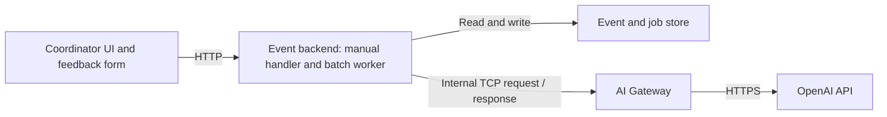

# F8 — Internal AI Gateway over TCP

[All specifications](README.md) · [Generation queue](07-generation-queue.md) · [OpenAI security](08-openai-security.md)

Status: **Confirmed by the user** (service boundary 2026-10-02; transport and lanes 2026-10-03). Every AI/provider call goes through an internal AI Gateway using the OpenAI Agents SDK. The event backend calls it over TCP using Node's native `net` with length-prefixed framing ([T3 §9](12-architecture-and-repository.md#9-ai-gateway)). Application implementation has not started.

## Outcome and scope

Centralise AI access and its security controls in one internal service. The browser, event API, queue worker and any future application callers must not call OpenAI directly. For this assignment the Gateway exposes one supported briefing operation; no generic public prompt proxy, provider marketplace or additional AI capability is required.

Contribution to the [client goal](README.md#product-goal-solve-the-client-situation): keep generation consistent and bounded while preserving the event backend's authority over attendance, evidence and saved human work.

Run the Gateway as a separate Node.js/TypeScript process. The event API and its queue worker remain together in the event-backend process. Only the event backend writes the event/job store. The Gateway does not share that writable store or require its own database.

Both backend applications live in the root pnpm workspace as `apps/event-api` and `apps/ai-gateway`; shared RPC contracts are in `packages/contracts` and framing in `packages/tcp-rpc` ([T3](12-architecture-and-repository.md)). Express serves the event HTTP API. The Gateway uses the OpenAI Agents SDK for one briefing agent with structured output; it does not gain tools, handoffs or application-write permissions. Existing credential, deadline, retry and untrusted-input controls still apply.

## Ownership

| Responsibility | Owner |
| --- | --- |
| Coordinator HTTP endpoints, attendance counts and input snapshots | Event backend |
| Synchronous manual generation, feedback batching (fixed windows), batch retry scheduling and job recovery | Event backend |
| Attendance/feedback freshness and authoritative evidence checks | Event backend |
| Selected/incoming preview slots, human text edits and Save | Event backend |
| TCP service endpoint, caller authentication and request limits | AI Gateway |
| OpenAI key, HTTPS client/SDK, provider URL and model configuration | AI Gateway only |
| Application-owned briefing prompt/profile, output schema and prompt version | AI Gateway, implementing the content rules in F4 |
| Provider refusal/incomplete-response handling, error normalisation and usage metadata | AI Gateway |
| Provider concurrency per lane (`interactive` for the coordinator, `background` for batches; one call each) and model-usage backstop limits | AI Gateway |

Keep the TCP DTOs and overlapping schema validators in one shared contract module consumed by both services. Reuse the existing briefing item/content contracts; do not create parallel response DTOs or duplicate validation functions. The Gateway checks request/output structure and the allowed operation. The event backend checks the returned evidence against its authoritative saved snapshot before publishing a preview. Shared validation does not give the Gateway event-write authority.

## TCP operation

Use request/response RPC with the operation name `briefing.generate.v1`. The name versions a service contract, not attendance records. Use the chosen framework's framing/correlation support where available; do not treat one TCP read as one complete message.

| Request field | Contract |
| --- | --- |
| `operation` | Exactly `briefing.generate.v1`; reject unknown operations/versions |
| `requestId` | Unique correlation ID for this RPC attempt |
| `runId`, `attemptId` | Backend-owned run identity (manual run ID or batch job ID) and current attempt |
| `lane` | `interactive` (coordinator Generate) or `background` (feedback batch). Gateway allows one in-flight call per lane, so a batch can never occupy the coordinator's slot |
| `deadlineAt` | Absolute completion deadline; Gateway may shorten it to its own configured limit |
| `input.event` | Minimal event ID/name/status needed for the briefing |
| `input.counts` | Backend-derived registered/attended/absent/not-recorded counts; validate nonnegative integers and the sum |
| `input.feedback` | Immutable job snapshot of stable IDs and exact note text; unique IDs and bounded size |

The authenticated transport envelope carries a separate internal service credential. It is not a domain payload field, queue field or model input. Do not accept raw caller prompts, model names, provider URLs, tools, arbitrary schemas, an OpenAI key, member names or client-supplied generation provenance.

On success return the matching request/attempt IDs, the structured generated sections (`themes`, `conflicts`, `suggestions`) and sanitised metadata: configured model, prompt version, provider request ID when available and token usage. Reuse the section shapes in [F4](04-ai-briefing-generation.md). The event backend builds the deterministic attendance overview, attaches the input baseline and assigns/persists preview provenance.

On failure return matching IDs and a bounded error envelope: stable `code`, safe `message`, whether the provider request is known not to have been sent, and an optional `retryAfterMs`. The queue decides whether a new attempt is allowed. Never return raw provider responses, keys, stack traces or source text in errors.

## End-to-end call flow

1. Either the manual generation handler (synchronous, `interactive` lane) or the batch worker after a window closes (`background` lane) captures saved counts and the event's complete feedback set through the shared generation service ([T5](14-generation-queue-implementation.md)). The Gateway never sees windows or individual note triggers.
2. The shared Gateway client sends the typed request over the configured internal TCP connection. The event backend has no OpenAI key or provider client.
3. Gateway authenticates the caller, validates the envelope/input and checks deadline, frame size, concurrency and usage limits before a paid request.
4. Gateway selects its configured briefing profile, prompt and model. It puts feedback in the untrusted user-data message, applies [S1](08-openai-security.md) and makes the only outbound OpenAI call.
5. Gateway handles provider errors/refusal/incomplete output and validates structured output. It returns a candidate, not a saved briefing or an instruction to take action.
6. The caller (handler or worker) verifies correlation and the active attempt, reuses schema validation and checks references/theme rules against the captured feedback set. It recomputes freshness from current saved input.
7. Only the event backend may commit the incoming preview and successful job state. Late, mismatched, invalid or expired results cannot write application state.

Every future AI operation must use this service boundary. Add a new typed operation only when a real requirement needs it; callers cannot bypass the boundary through SDK calls or direct HTTP requests.

## Internal transport security

- For the local assignment, bind the Gateway TCP listener to loopback and configure the backend with its host/port. Do not expose a browser route, public listener, wildcard bind or public container port for it.
- Authenticate the backend with a separate Gateway service secret, validated before executing an operation. Keep both this secret and the OpenAI key out of logs, prompts and client responses. Only the Gateway receives the OpenAI key; the event backend receives only the internal credential.
- TCP itself provides neither encryption nor application authentication. Loopback plus service authentication is the local contract. Moving the service across hosts requires a separate transport review and authenticated TLS, such as mTLS; do not send the service credential over an unprotected remote TCP link.
- Frame messages explicitly through the selected transport. Bound frame size before allocating/reading a declared body, reject malformed/truncated messages, and handle fragmented or combined TCP reads correctly. Frame ceilings: 64 KiB request and 128 KiB response, alongside S1's tighter source/output limits.
- Bound connection establishment, idle reads and concurrent requests. Gateway limits cannot be raised by values supplied in the request.
- Enforce the boundary through service configuration and repository checks: provider credentials/client imports and provider HTTP call sites belong only to the Gateway. If network-level egress restrictions are available, allow provider access only from the Gateway process/container.

## Deadlines, retries and uncertain outcomes

Keep **one retry owner: the event backend** (BullMQ for batches; manual generation never retries automatically). Gateway, the TCP client and the OpenAI SDK do not independently retry/resend a generation request. Configure SDK automatic retries off. Reconnecting a socket is not permission to replay its request.

Use F7's bounded batch policy and the persisted provider cooldown shared by manual and batch generation; a terminal job or restart cannot clear that cooldown, and a manual request during it gets `429 PROVIDER_COOLDOWN`. The Gateway's provider timeout must fit inside the RPC deadline, leaving time to return an error; the caller's RPC wait must also fit inside the overall job deadline. Never renew the deadline on reconnect. Gateway aborts its local provider request when the deadline expires; cancellation at the provider is best effort. The backend rejects results after the attempt deadline even if a socket later delivers them.

| Failure | Required behaviour |
| --- | --- |
| Connection refused before request dispatch, or Gateway explicitly rejects capacity before submission | Queue may retry within attempt/deadline limits; no direct-provider fallback |
| Bad credential, unknown operation, invalid payload or missing Gateway provider configuration | Terminal job failure with a safe error; no automatic retry loop |
| Explicit temporary provider error or temporary rate limit | Gateway returns a normalised error/cooldown; queue applies its bounded backoff policy |
| TCP connection lost after sending, provider timeout with uncertain completion, or Gateway restart during a call | Record `AI_OUTCOME_UNKNOWN`; preserve existing content and require coordinator Retry for another paid attempt; do not replay automatically |
| Refusal, incomplete output or invalid candidate | Terminal generation failure; retain prior content; no automatic prompt-repair loop |
| Late response from an old attempt | Discard it; never commit over newer job/result state |

Correlation IDs prevent wrong-result commits; they do not guarantee exactly-once OpenAI execution or billing. Retrying an unknown outcome may incur another provider charge. A coordinator retry (the Retry button, which sends a normal synchronous Generate request under D13) captures current saved inputs with a fresh run/attempt/request identity, still respecting usage limits and any provider cooldown; the UI asks for confirmation after `AI_OUTCOME_UNKNOWN`. Automatic batch retries apply only to known retryable outcomes. A batch interrupted after dispatch is never replayed.

## Acceptance criteria

| ID | Scenario | Expected result |
| --- | --- | --- |
| F8-01 | Manual or automatic generation | Manual handler (interactive lane) or batch worker (background lane) calls Gateway via TCP; only Gateway calls OpenAI |
| F8-02 | Inspect service configuration and provider call sites | OpenAI credential and provider client/HTTP calls exist only in Gateway; no browser/event-backend fallback |
| F8-03 | Unknown operation, invalid credential, oversized frame or malformed counts | Gateway rejects before a provider request and returns no sensitive error data |
| F8-04 | Feedback contains prompt injection | Gateway keeps it in the data message; no tools or application writes; backend still validates returned evidence |
| F8-05 | TCP frames arrive fragmented or combined | Exactly the framed messages are decoded; wrong correlation IDs and extra fields are rejected |
| F8-06 | Gateway is unavailable | Manual: immediate `503 GATEWAY_UNAVAILABLE`. Batch: bounded retry, then failure shown. All content preserved; no direct OpenAI call. |
| F8-11 | A batch call is running when the coordinator generates | The interactive lane accepts the manual call immediately; the batch call is not cancelled |
| F8-07 | Connection is lost after submission or Gateway restarts mid-call | Unknown outcome shown; no blind resend; coordinator Retry is required for another paid attempt |
| F8-08 | Late result, expired deadline or superseded attempt | Backend does not publish it or alter saved human work |
| F8-09 | Temporary rate limit | Batch: one queue-managed retry policy honours the cooldown. Manual: `429` with retry time. SDK/RPC layers never multiply calls. |
| F8-10 | Normal successful response | Shared contract validates at both boundaries; backend owns final evidence checks and incoming-preview persistence |

## Trade-off

The separate service centralises provider credentials and AI policy, as requested. It adds a process, an authenticated TCP boundary and failure cases the application must report. Keep this implementation to one Gateway operation, two lanes and one event-backend batch worker; no second queue, Gateway database, service discovery or distributed deployment is needed for this scope.
