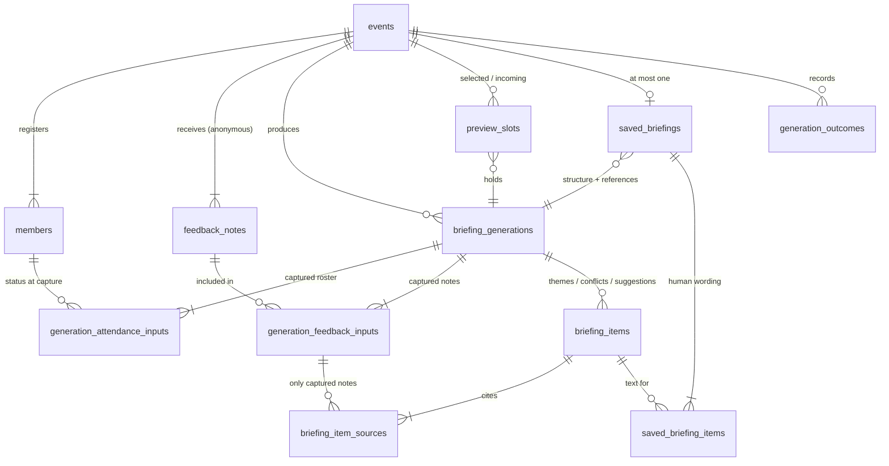

# T4 — Data model, relations and transactions

[All specifications](README.md) · [Architecture (T3)](12-architecture-and-repository.md) · [Generation implementation (T5)](14-generation-queue-implementation.md)

Status: **Confirmed by the user on 2026-10-03** (D3, D15). The DDL in §4 is the source of truth for the first migration.

## 1. Design choices

| Choice | Recommendation | Why |
| --- | --- | --- |
| Shape | **Normalised tables**, not JSON documents | The database itself enforces the evidence rules (§3), which is the strongest showcase of the relational model here. JSON columns would leave every rule to application code. |
| Evidence integrity | Composite foreign keys | A cited note must be part of *that generation's* input; a saved text row must belong to *that saved briefing's* generation |
| Preview slots | A `preview_slots` table (`selected`, `incoming`); an empty slot is a missing row | Avoids circular FKs between `events` and `briefing_generations` and nullable slot columns; `UNIQUE(generation_id)` stops one generation from occupying two slots |
| Identifiers | `VARCHAR … CHARACTER SET ascii COLLATE ascii_bin` for business IDs (`E101`, `M01`, `F01`); `CHAR(36)` UUIDv7 for generated rows | Case-sensitive, exact matching (`f01` ≠ `F01`). UUIDv7 sorts by time and stays readable while debugging. |
| Text | `utf8mb4`, `utf8mb4_0900_ai_ci` | Full Unicode in feedback and human edits |
| Rules in the DB | `CHECK` constraints (MySQL 8.0.16+ enforces them) for non-blank text, position bounds and outcome consistency | Defence in depth behind the Zod validation |
| Reserved words | `trigger` is reserved in MySQL → column `trigger_type` | Avoids quoting everywhere |
| Time | `DATETIME(3)` stored in UTC; TypeORM `timezone: "Z"` | Millisecond precision for `input_captured_at` comparisons (F7 slot rules) |
| Counts and freshness | **Never stored**; derived from rows | Brief: "calculate attendance counts in application code from saved records" |
| Migrations | Hand-written SQL migrations based on §4 (`synchronize: false`); TypeORM `EntitySchema` used for mapping and queries | TypeORM's migration generator cannot express every composite FK and `CHECK`. The DDL stays reviewable as written. |
| Rules the DB cannot express | Theme/conflict ≥ 2 distinct notes, suggestion/summary ≥ 1, exactly one summary, every item having a saved text row | Enforced in the shared `validateEvidenceSections()` and inside the save transaction. Triggers are avoided because they hide logic. |

## 2. Relations

| Spec rule | Relation |
| --- | --- |
| One seeded event with four registered members (F1) | `events` 1 — N `members` |
| Notes come from the event's feedback form: eight seeded, more added by the test form/script (F3) | `events` 1 — N `feedback_notes`, with server-assigned IDs F09, F10, … |
| Notes are anonymous and not linked to the roster (brief, F3) | **No relation** between `feedback_notes` and `members` |
| A generation captures saved attendance and the complete feedback set when it runs (F4, F7) | `briefing_generations` 1 — N `generation_attendance_inputs` and 1 — N `generation_feedback_inputs` |
| Freshness compares the snapshot with current data per member (D5) | `generation_attendance_inputs` → `members` |
| Positioned items in fixed sections (D2), including exactly one feedback summary (D16) | `briefing_generations` 1 — N `briefing_items` (`section = 'summary'` at position 0) |
| Items cite only notes from that generation's input (F4 rule 3) | `briefing_items` 1 — N `briefing_item_sources` → `generation_feedback_inputs` |
| One selected and one incoming preview (F7) | `events` 1 — 0..2 `preview_slots` → `briefing_generations` |
| At most one saved briefing; text-only edits keep the generation's references (D2, F5) | `events` 1 — 0..1 `saved_briefings` → `briefing_generations`; `saved_briefings` 1 — N `saved_briefing_items` → `briefing_items` |
| Each generation run's final result is shown in the UI (F7) | `events` 1 — N `generation_outcomes` (latest 20 kept) |



## 3. What the database guarantees

| Guarantee | Enforced by |
| --- | --- |
| A briefing cannot cite F99, or a note added after its input was captured | FK `briefing_item_sources (generation_id, feedback_id)` → `generation_feedback_inputs` |
| The same note cannot be cited twice on one item | PK `briefing_item_sources (item_id, feedback_id)` |
| A saved briefing cannot change references | `saved_briefings` stores no references; `saved_briefing_items` can only point at items of the saved briefing's own generation (two composite FKs) |
| A preview slot cannot point at another event's generation | FK `preview_slots (event_id, generation_id)` → `briefing_generations (event_id, id)` |
| A generation in use cannot be deleted | `ON DELETE RESTRICT` from `preview_slots` and `saved_briefings` |
| A run commits at most once | `UNIQUE briefing_generations.run_id`, PK `generation_outcomes.run_id` |
| A resubmitted form entry does not duplicate a note | `UNIQUE feedback_notes (event_id, submission_id)` |
| Blank text cannot be stored | `CHECK (CHAR_LENGTH(TRIM(text)) > 0)` on every text column |
| At most one feedback summary per generation, within 600 characters | `ck_item_summary` (summary only at position 0, ≤ 600 chars) + `UNIQUE (generation_id, section, position)`; "exactly one" is checked in code |
| Attendance is one of exactly three states | `ENUM('attended','absent','not_recorded')` |

## 4. DDL (first migration)

```sql
-- Business identifiers: exact, case-sensitive ASCII.  Free text: utf8mb4.
CREATE TABLE events (
  id                     VARCHAR(16)  CHARACTER SET ascii COLLATE ascii_bin NOT NULL,
  name                   VARCHAR(120) NOT NULL,
  club_name              VARCHAR(120) NOT NULL,
  status                 ENUM('ended') NOT NULL,
  attendance_revision    INT UNSIGNED NOT NULL DEFAULT 0,
  briefing_revision      INT UNSIGNED NOT NULL DEFAULT 0,
  next_feedback_number   INT UNSIGNED NOT NULL,
  feedback_pending_since DATETIME(3)  NULL,
  created_at             DATETIME(3)  NOT NULL DEFAULT CURRENT_TIMESTAMP(3),
  updated_at             DATETIME(3)  NOT NULL DEFAULT CURRENT_TIMESTAMP(3) ON UPDATE CURRENT_TIMESTAMP(3),
  PRIMARY KEY (id)
) ENGINE=InnoDB DEFAULT CHARSET=utf8mb4 COLLATE=utf8mb4_0900_ai_ci;

CREATE TABLE members (
  event_id      VARCHAR(16) CHARACTER SET ascii COLLATE ascii_bin NOT NULL,
  id            VARCHAR(16) CHARACTER SET ascii COLLATE ascii_bin NOT NULL,
  name          VARCHAR(120) NOT NULL,
  attendance    ENUM('attended','absent','not_recorded') NOT NULL,
  display_order SMALLINT UNSIGNED NOT NULL,
  PRIMARY KEY (event_id, id),
  UNIQUE KEY uq_members_order (event_id, display_order),
  CONSTRAINT fk_members_event FOREIGN KEY (event_id) REFERENCES events (id)
) ENGINE=InnoDB DEFAULT CHARSET=utf8mb4 COLLATE=utf8mb4_0900_ai_ci;

CREATE TABLE feedback_notes (               -- insert-only; no member column by design
  event_id      VARCHAR(16) CHARACTER SET ascii COLLATE ascii_bin NOT NULL,
  id            VARCHAR(16) CHARACTER SET ascii COLLATE ascii_bin NOT NULL,
  text          VARCHAR(1000) NOT NULL,
  origin        ENUM('seed','submitted') NOT NULL,
  submission_id CHAR(36) CHARACTER SET ascii COLLATE ascii_bin NULL,
  received_at   DATETIME(3) NOT NULL,
  display_order INT UNSIGNED NOT NULL,
  PRIMARY KEY (event_id, id),
  UNIQUE KEY uq_feedback_submission (event_id, submission_id),
  UNIQUE KEY uq_feedback_order (event_id, display_order),
  CONSTRAINT fk_feedback_event FOREIGN KEY (event_id) REFERENCES events (id),
  CONSTRAINT ck_feedback_text CHECK (CHAR_LENGTH(TRIM(text)) > 0),
  CONSTRAINT ck_feedback_origin CHECK ((origin = 'seed') = (submission_id IS NULL))
) ENGINE=InnoDB DEFAULT CHARSET=utf8mb4 COLLATE=utf8mb4_0900_ai_ci;

CREATE TABLE briefing_generations (         -- immutable once written
  id                  CHAR(36)    CHARACTER SET ascii COLLATE ascii_bin NOT NULL,
  event_id            VARCHAR(16) CHARACTER SET ascii COLLATE ascii_bin NOT NULL,
  run_id              VARCHAR(64) CHARACTER SET ascii COLLATE ascii_bin NOT NULL,
  trigger_type        ENUM('manual','feedback_batch') NOT NULL,
  model               VARCHAR(100) NOT NULL,
  prompt_version      VARCHAR(32)  NOT NULL,
  attendance_overview VARCHAR(500) NOT NULL,
  feedback_digest     CHAR(64) CHARACTER SET ascii COLLATE ascii_bin NOT NULL,
  input_captured_at   DATETIME(3) NOT NULL,
  generated_at        DATETIME(3) NOT NULL,
  PRIMARY KEY (id),
  UNIQUE KEY uq_generation_run (run_id),
  UNIQUE KEY uq_generation_event (event_id, id),        -- target for event-scoped composite FKs
  CONSTRAINT fk_generation_event FOREIGN KEY (event_id) REFERENCES events (id),
  CONSTRAINT ck_generation_overview CHECK (CHAR_LENGTH(TRIM(attendance_overview)) > 0)
) ENGINE=InnoDB DEFAULT CHARSET=utf8mb4 COLLATE=utf8mb4_0900_ai_ci;

CREATE TABLE generation_attendance_inputs (
  generation_id CHAR(36)    CHARACTER SET ascii COLLATE ascii_bin NOT NULL,
  event_id      VARCHAR(16) CHARACTER SET ascii COLLATE ascii_bin NOT NULL,
  member_id     VARCHAR(16) CHARACTER SET ascii COLLATE ascii_bin NOT NULL,
  attendance    ENUM('attended','absent','not_recorded') NOT NULL,
  PRIMARY KEY (generation_id, member_id),
  CONSTRAINT fk_att_input_generation FOREIGN KEY (event_id, generation_id)
    REFERENCES briefing_generations (event_id, id) ON DELETE CASCADE,
  CONSTRAINT fk_att_input_member FOREIGN KEY (event_id, member_id) REFERENCES members (event_id, id)
) ENGINE=InnoDB;

CREATE TABLE generation_feedback_inputs (
  generation_id CHAR(36)    CHARACTER SET ascii COLLATE ascii_bin NOT NULL,
  event_id      VARCHAR(16) CHARACTER SET ascii COLLATE ascii_bin NOT NULL,
  feedback_id   VARCHAR(16) CHARACTER SET ascii COLLATE ascii_bin NOT NULL,
  PRIMARY KEY (generation_id, feedback_id),
  CONSTRAINT fk_fb_input_generation FOREIGN KEY (event_id, generation_id)
    REFERENCES briefing_generations (event_id, id) ON DELETE CASCADE,
  CONSTRAINT fk_fb_input_note FOREIGN KEY (event_id, feedback_id) REFERENCES feedback_notes (event_id, id)
) ENGINE=InnoDB;

CREATE TABLE briefing_items (
  id            CHAR(36) CHARACTER SET ascii COLLATE ascii_bin NOT NULL,
  generation_id CHAR(36) CHARACTER SET ascii COLLATE ascii_bin NOT NULL,
  section       ENUM('summary','theme','conflict','suggestion') NOT NULL,
  position      TINYINT UNSIGNED NOT NULL,
  text          VARCHAR(1000) NOT NULL,
  PRIMARY KEY (id),
  UNIQUE KEY uq_item_position (generation_id, section, position),
  UNIQUE KEY uq_item_generation (generation_id, id),      -- target for composite FKs
  CONSTRAINT fk_item_generation FOREIGN KEY (generation_id) REFERENCES briefing_generations (id) ON DELETE CASCADE,
  CONSTRAINT ck_item_position CHECK (position < 10),
  CONSTRAINT ck_item_summary CHECK (section <> 'summary' OR (position = 0 AND CHAR_LENGTH(text) <= 600)),
  CONSTRAINT ck_item_text CHECK (CHAR_LENGTH(TRIM(text)) > 0)
) ENGINE=InnoDB DEFAULT CHARSET=utf8mb4 COLLATE=utf8mb4_0900_ai_ci;

CREATE TABLE briefing_item_sources (
  item_id       CHAR(36)    CHARACTER SET ascii COLLATE ascii_bin NOT NULL,
  generation_id CHAR(36)    CHARACTER SET ascii COLLATE ascii_bin NOT NULL,
  feedback_id   VARCHAR(16) CHARACTER SET ascii COLLATE ascii_bin NOT NULL,
  position      TINYINT UNSIGNED NOT NULL,                -- citation order as returned
  PRIMARY KEY (item_id, feedback_id),
  UNIQUE KEY uq_source_position (item_id, position),
  CONSTRAINT fk_source_item FOREIGN KEY (generation_id, item_id)
    REFERENCES briefing_items (generation_id, id) ON DELETE CASCADE,
  CONSTRAINT fk_source_input FOREIGN KEY (generation_id, feedback_id)
    REFERENCES generation_feedback_inputs (generation_id, feedback_id) ON DELETE CASCADE,
  CONSTRAINT ck_source_position CHECK (position < 8)
) ENGINE=InnoDB;

CREATE TABLE preview_slots (                -- no row = empty slot
  event_id      VARCHAR(16) CHARACTER SET ascii COLLATE ascii_bin NOT NULL,
  slot          ENUM('selected','incoming') NOT NULL,
  generation_id CHAR(36) CHARACTER SET ascii COLLATE ascii_bin NOT NULL,
  updated_at    DATETIME(3) NOT NULL,
  PRIMARY KEY (event_id, slot),
  UNIQUE KEY uq_slot_generation (generation_id),
  CONSTRAINT fk_slot_generation FOREIGN KEY (event_id, generation_id)
    REFERENCES briefing_generations (event_id, id) ON DELETE RESTRICT
) ENGINE=InnoDB;

CREATE TABLE saved_briefings (
  event_id            VARCHAR(16) CHARACTER SET ascii COLLATE ascii_bin NOT NULL,
  generation_id       CHAR(36)    CHARACTER SET ascii COLLATE ascii_bin NOT NULL,
  attendance_overview VARCHAR(500) NOT NULL,                 -- human-edited wording
  saved_at            DATETIME(3) NOT NULL,
  PRIMARY KEY (event_id),
  UNIQUE KEY uq_saved_generation (event_id, generation_id),  -- target for saved_briefing_items
  CONSTRAINT fk_saved_generation FOREIGN KEY (event_id, generation_id)
    REFERENCES briefing_generations (event_id, id) ON DELETE RESTRICT,
  CONSTRAINT ck_saved_overview CHECK (CHAR_LENGTH(TRIM(attendance_overview)) > 0)
) ENGINE=InnoDB DEFAULT CHARSET=utf8mb4 COLLATE=utf8mb4_0900_ai_ci;

CREATE TABLE saved_briefing_items (
  event_id      VARCHAR(16) CHARACTER SET ascii COLLATE ascii_bin NOT NULL,
  generation_id CHAR(36)    CHARACTER SET ascii COLLATE ascii_bin NOT NULL,
  item_id       CHAR(36)    CHARACTER SET ascii COLLATE ascii_bin NOT NULL,
  text          VARCHAR(1000) NOT NULL,                      -- human-edited wording
  PRIMARY KEY (event_id, item_id),
  CONSTRAINT fk_saved_item_briefing FOREIGN KEY (event_id, generation_id)
    REFERENCES saved_briefings (event_id, generation_id) ON DELETE CASCADE,
  CONSTRAINT fk_saved_item_item FOREIGN KEY (generation_id, item_id)
    REFERENCES briefing_items (generation_id, id),
  CONSTRAINT ck_saved_item_text CHECK (CHAR_LENGTH(TRIM(text)) > 0)
) ENGINE=InnoDB DEFAULT CHARSET=utf8mb4 COLLATE=utf8mb4_0900_ai_ci;

CREATE TABLE generation_outcomes (          -- latest 20 per event; not a queue
  run_id        VARCHAR(64) CHARACTER SET ascii COLLATE ascii_bin NOT NULL,
  event_id      VARCHAR(16) CHARACTER SET ascii COLLATE ascii_bin NOT NULL,
  trigger_type  ENUM('manual','feedback_batch') NOT NULL,
  status        ENUM('succeeded','failed','skipped','superseded','superseded_by_manual') NOT NULL,
  error_code    VARCHAR(40) CHARACTER SET ascii COLLATE ascii_bin NULL,
  generation_id CHAR(36)    CHARACTER SET ascii COLLATE ascii_bin NULL,   -- no FK: generation may be cleaned up
  finished_at   DATETIME(3) NOT NULL,
  PRIMARY KEY (run_id),
  KEY ix_outcomes_recent (event_id, finished_at),
  CONSTRAINT fk_outcome_event FOREIGN KEY (event_id) REFERENCES events (id),
  CONSTRAINT ck_outcome_error CHECK ((status = 'failed') = (error_code IS NOT NULL))
) ENGINE=InnoDB;
```

The InnoDB cascade paths form a tree (generation → inputs/items → sources), which MySQL supports. Feedback IDs are formatted `F` + at least two digits (`F09`, `F10`, `F100`) from `next_feedback_number`, which the seed sets to 9.

## 5. Derived values and retention

| Value | Derived from |
| --- | --- |
| Current counts | `members` |
| Counts used for a generation | `generation_attendance_inputs` |
| Freshness | per-member diff of `generation_attendance_inputs` vs `members` (a swap is a change; a revert matches again) + note-ID set diff of `generation_feedback_inputs` vs `feedback_notes` (lists new notes); `feedback_digest` as an integrity check |
| Generated `BriefingContent` | `briefing_items` + `briefing_item_sources`, ordered by `section` (summary, theme, conflict, suggestion), `position`; `attendanceOverview` from `briefing_generations` |
| Saved `BriefingContent` | the same items and sources, with text from `saved_briefing_items` and the overview from `saved_briefings` |

A generation is **referenced** if a `preview_slots` row or the `saved_briefings` row points at it. Any transaction that removes a reference runs `DELETE FROM briefing_generations WHERE id = ? AND NOT EXISTS (…references…)`. The RESTRICT FKs make deleting a referenced generation impossible even if that check had a bug. At most 3 generations exist per event.

Reading the view takes five set-based queries, never N+1:

1. Event, members and notes.
2. Slots and saved briefing.
3. The referenced generations.
4. Their items with sources.
5. Their inputs.

## 6. Transactions

Every write transaction begins with `SELECT … FROM events WHERE id = ? FOR UPDATE`:

- **One serialisation point** for every writer: tabs, HTTP handlers and the batch worker.
- **Revision checks happen inside the lock.**
- **One lock order** (event row first, then children), so deadlocks cannot happen.
- **Isolation:** InnoDB `REPEATABLE READ`. Read-only views use `START TRANSACTION READ ONLY` for a consistent snapshot without locks.
- **No transaction stays open across a network call** (AI Gateway, Redis).

| # | Use case | Actor | Lock | Writes | After commit |
| --- | --- | --- | --- | --- | --- |
| TX1 | Seed once | startup | — | `events`, `members`, `feedback_notes`. A duplicate key on `events` means the data is already seeded: roll back and continue. | — |
| TX2 | Build event view | `GET /events/:id` (cache miss) | read-only snapshot | — | cache `SET` (versioned) |
| TX3 | Save attendance | `PUT /attendance` | event row | changed `members`; `attendance_revision + 1` only if something changed | flush cache → SSE |
| TX4 | Capture input (manual) | `POST /briefing-generations` | read-only snapshot | — (checks `baseAttendanceRevision`) | Gateway call |
| TX5 | Commit generation | manual handler / batch worker | event row | Apply the F7 incoming-slot rules using `trigger_type` + `input_captured_at`. If accepted: insert the generation, inputs, items and sources; upsert `preview_slots('incoming')`; delete the replaced generation if unreferenced. Always insert `generation_outcomes`. | complete the batch job, flush cache → SSE |
| TX6 | Record failed or skipped run | manual handler / batch worker | — | `generation_outcomes` + prune to 20 | flush cache → SSE |
| TX7 | Select incoming | `POST /briefing-preview/select` | event row | Check that the incoming row equals `generationId` and the selected row equals `expected` (else 409). Move incoming → selected (delete incoming row, upsert selected). Delete the old selected generation if unreferenced. | flush cache → SSE |
| TX8 | Save briefing | `PUT /briefing` | event row | Check `briefing_revision`. Resolve `generationId` against saved or selected (else 409). Validate the text count against `briefing_items`. Write `saved_briefings` + `saved_briefing_items`. If it came from selected, delete the selected row. Delete the previously saved generation if unreferenced. `briefing_revision + 1`. | flush cache → SSE |
| TX9 | Submit feedback | `POST /feedback` | event row | If the `submission_id` exists → return that note. Else check limits, insert note `F{next}`, increment `next_feedback_number`, set `feedback_pending_since` if null. | schedule the batch, flush cache → SSE |
| TX10 | Capture input (batch) | batch worker | event row | Read members and notes; clear `feedback_pending_since` | "nothing new" check, Gateway call |

Order inside TX8 when replacing a saved briefing that was based on another generation:

1. Delete the old `saved_briefing_items`.
2. Update `saved_briefings.generation_id` and the overview.
3. Insert the new text rows.
4. Delete the `selected` slot row.
5. Delete the old generation if it is now unreferenced.

Foreign keys stay valid at every step.

### Cross-store boundaries (MySQL ↔ Redis)

MySQL and Redis cannot share a transaction. The rule: **commit MySQL first, then do Redis/BullMQ work, and make each step idempotent or self-healing.**

| Boundary | Failure | Why it is safe |
| --- | --- | --- |
| TX9 → batch scheduling | BullMQ `add` fails | The note is saved and `feedback_pending_since` stays set; reconcile on startup or the next note. The response says `automaticBriefing: "deferred"`. |
| TX5 → job completion | Crash between commit and BullMQ completion | The re-run finds its `run_id` (UNIQUE) and completes without calling the AI |
| Any TX → cache flush / SSE | Redis flush fails | `cacheBypass` serves reads from MySQL until a flush succeeds |

## 7. Code shape

```ts
// apps/event-api/src/ports/unit-of-work.ts
export interface UnitOfWork {
  run<T>(work: (tx: TransactionScope) => Promise<T>): Promise<T>;        // BEGIN … COMMIT, retries nothing
  readSnapshot<T>(work: (tx: ReadScope) => Promise<T>): Promise<T>;      // START TRANSACTION READ ONLY
}
export interface TransactionScope extends ReadScope {
  events: EventWriteRepository;            // lockForUpdate(), applyAttendanceChanges(), insertFeedback()
  generations: GenerationWriteRepository;  // insert(), deleteIfUnreferenced()
  slots: PreviewSlotRepository;            // get(), put(), clear()
  briefings: SavedBriefingWriteRepository;
  outcomes: GenerationOutcomeRepository;
  afterCommit(effect: () => Promise<void>): void;   // runs only after COMMIT succeeds
}
```

```ts
// apps/event-api/src/modules/attendance/attendance-service.ts
export class AttendanceService {
  constructor(private readonly uow: UnitOfWork, private readonly changes: EventChangePublisher) {}

  async save(command: SaveAttendanceCommand): Promise<AttendanceSaved> {
    return this.uow.run(async (tx) => {
      const event = await tx.events.lockForUpdate(command.eventId);
      assertRevision(event.attendanceRevision, command.baseAttendanceRevision, "ATTENDANCE_CONFLICT");
      const changes = diffAttendance(event.members, command.members);          // pure domain function
      if (changes.length === 0) return toAttendanceSaved(event);

      const updated = await tx.events.applyAttendanceChanges(event, changes);  // bumps attendance_revision
      tx.afterCommit(() => this.changes.publish(event.id));                     // cache flush + SSE "changed"
      return toAttendanceSaved(updated);
    });
  }
}
```

TypeORM mapping (`EntitySchema`, no decorators, since esbuild does not emit decorator metadata):

```ts
// apps/event-api/src/persistence/entities/briefing-item-source.entity.ts
export const BriefingItemSourceEntity = new EntitySchema<BriefingItemSourceRow>({
  name: "BriefingItemSource",
  tableName: "briefing_item_sources",
  columns: {
    itemId:       { name: "item_id", type: "char", length: 36, primary: true, ...asciiBin },
    feedbackId:   { name: "feedback_id", type: "varchar", length: 16, primary: true, ...asciiBin },
    generationId: { name: "generation_id", type: "char", length: 36, ...asciiBin },
    position:     { type: "tinyint", unsigned: true },
  },
});
```

Repositories map rows explicitly to domain types, and every row is parsed with the shared Zod schemas. Relations are expressed in queries, not with lazy or eager loading, and `cascade: true` is never used, so every write is visible in code review.

## 8. Acceptance checks for the data layer

| ID | Check |
| --- | --- |
| T4-01 | Inserting a `briefing_item_sources` row whose note is not in that generation's input fails at the database |
| T4-02 | A `saved_briefing_items` row cannot point at an item from a different generation |
| T4-03 | Deleting a generation held by a slot or the saved briefing fails (RESTRICT); unreferenced generations disappear with all children |
| T4-04 | Two concurrent attendance saves from the same revision: one commits, the other gets 409, with no partial rows |
| T4-05 | Running TX5 twice with the same `run_id` commits once; the second run completes without a model call |
| T4-06 | Killing the process inside TX8 leaves the previous saved briefing intact after restart |
| T4-07 | Swap Alex/Bea → freshness reports two changed members; swap back → current |
| T4-08 | Two submissions with the same `submission_id` create one note; concurrent submissions get consecutive IDs (F09, F10) |
| T4-09 | A note committed while TX10 runs leaves `feedback_pending_since` set and leads to another batch |
| T4-10 | Looking up `f01` does not match `F01` (binary collation) |
| T4-11 | Inserting blank or whitespace-only text into any text column fails the `CHECK` |
