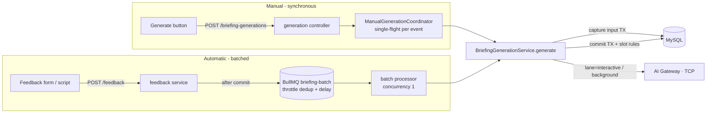

# T5 — Generation implementation: manual path and batch queue

[All specifications](README.md) · [Batch behaviour (F7)](07-generation-queue.md) · [Generation rules (F4)](04-ai-briefing-generation.md) · [Data model (T4)](13-data-model-and-transactions.md) · [AI Gateway (F8)](09-ai-gateway.md)

Status: **Confirmed by the user on 2026-10-03** (BullMQ, D7). The behaviour is defined in F4/F7. The spike in §6 must pass before the batch path is built on it.

## 1. Two paths, one generation service



`BriefingGenerationService.generate({ eventId, trigger, runId, signal })` is the **only** code that captures input, calls the Gateway client, validates evidence and commits. Both paths call it, so prompt input, validation and slot rules exist once.

| Step | Manual | Batch |
| --- | --- | --- |
| Capture input | TX4 read-only snapshot (T4) | TX10: snapshot **and** clear `feedback_pending_since` in one transaction |
| Nothing-new check | No; the coordinator asked explicitly | Yes: skip if input equals the latest generation's input |
| Gateway lane | `interactive` | `background` |
| Retries | None (Retry button = Generate again) | Bounded (BullMQ `attempts` + custom backoff) |
| Commit | TX5 with slot rules | TX5 with slot rules (`superseded_by_manual` possible) |
| Response | `201` with the generated preview | SSE `changed` + "ready" notice |

## 2. Manual path

```ts
// apps/event-api/src/modules/generation/manual-generation-coordinator.ts
export class ManualGenerationCoordinator {
  private readonly inFlight = new Map<EventId, Promise<GenerationResult>>();

  generate(eventId: EventId, baseAttendanceRevision: number): Promise<GenerationResult> {
    const running = this.inFlight.get(eventId);
    if (running) return running;                                    // second click / second tab joins the same call

    const run = this.generation
      .generate({ eventId, trigger: "manual", runId: newRunId(), baseAttendanceRevision })
      .finally(() => this.inFlight.delete(eventId));
    this.inFlight.set(eventId, run);
    return run;
  }

  whenIdle(eventId: EventId): Promise<void> {                      // used by the batch processor
    return (this.inFlight.get(eventId) ?? Promise.resolve()).then(noop, noop);
  }
}
```

- **Not tied to the browser.** The HTTP handler awaits the promise, but the call does **not** take the request's abort signal. A refresh or a closed tab does not cancel a paid call, and the result is still committed to the incoming slot.
- **Deadlines.** The server deadline is `MANUAL_GENERATION_TIMEOUT_MS` (default 60 s); the Axios timeout is 90 s. A timeout after sending returns `504 AI_OUTCOME_UNKNOWN`.
- **Pre-checks run before any paid call:**
  - `baseAttendanceRevision` must match, else `409 ATTENDANCE_CONFLICT`.
  - The provider cooldown must not be active, else `429 PROVIDER_COOLDOWN` with `retryAfterMs`.
  - The daily budget must not be exhausted, else `429 DAILY_LIMIT_REACHED`.
- **Single process.** Single-flight is in-process; that is correct because the event API runs as one process (T3 §3).

## 3. Batch path (BullMQ)

### Scheduling a batch

```ts
// apps/event-api/src/integrations/bullmq-briefing-batch-queue.ts
await queue.add("briefing.batch", { eventId }, {
  deduplication: { id: `briefing-batch:${eventId}`, ttl: config.batchWindowMs },  // throttle mode: fixed, not extended
  delay: config.batchWindowMs,                                                   // runs at the window's cutoff
  attempts: config.batchMaxAttempts,                                             // 3
  backoff: { type: "provider-aware" },                                           // custom strategy below
  removeOnComplete: { count: 50 }, removeOnFail: { count: 50 },
});
```

BullMQ's **throttle** de-duplication fits F7 directly:

- While the de-duplication key lives (`ttl = window`), further `add` calls are ignored.
- The TTL is **not** extended, because `extend` and `replace` are not used. That gives the fixed window.
- The delayed job fires at the cutoff.
- No candidate data is stored in the job: the processor reads current data when it runs.

### Processing a batch

```ts
// apps/event-api/src/modules/generation/batch-generation-processor.ts
async process(job: BatchJob): Promise<BatchOutcome> {
  const { eventId } = job.data;
  if (await this.queue.hasNewerReadyJob(eventId, job)) return this.outcome(job, "superseded");
  await this.manual.whenIdle(eventId);                              // coordinator priority

  if (job.data.dispatch === "sending" && !(await this.outcomes.exists(job.id)))
    throw new UnrecoverableError("AI_OUTCOME_UNKNOWN");             // crashed mid-call: never replay

  return this.generation.generate({
    eventId, trigger: "feedback_batch", runId: job.id, skipIfUnchanged: true, lane: "background",
    beforeDispatch: () => job.updateData({ ...job.data, dispatch: "sending" }),  // persisted before the socket write
  });                                                               // returns succeeded | skipped | superseded_by_manual
}
```

| Concern | Mechanism |
| --- | --- |
| One batch at a time | Worker `concurrency: 1` |
| Retries with cooldown | `settings.backoffStrategy` returns `max(exponentialJitter(attemptsMade), error.retryAfterMs)` and records the shared cooldown in Redis. Non-retryable errors throw `UnrecoverableError`. |
| Crash recovery | Stalled detection (`maxStalledCount: 1`) re-runs the job. The `dispatch` marker decides between resuming and `AI_OUTCOME_UNKNOWN`. The UNIQUE run ID in MySQL makes commits idempotent. |
| Lost scheduling | `events.feedback_pending_since` (set in the note transaction) plus a reconcile step on startup and on every note save |
| Budget | `INCR event-desk:gen:usage:{eventId}:{utcDay}:{total\|batch}`. Batch attempts stop at the batch cap; manual attempts stop at the total. |
| Status for the UI | `queue.getJobs(["delayed","waiting","active"])` filtered by `eventId`, plus `job.data` and the cooldown key, mapped to `BatchStatusView`. Every state change flushes the event-view cache, which emits SSE `changed`. |

## 4. Gateway lanes

The Gateway accepts at most **one call per lane** (`interactive`, `background`), so at most two provider calls run at once. `lane` is a field of the authenticated RPC envelope ([F8](09-ai-gateway.md)). A batch call can never take the coordinator's slot.

## 5. Redis keys

| Key | Purpose |
| --- | --- |
| `bull:briefing-batch:*` | BullMQ jobs and the de-duplication key (fixed window) |
| `event-desk:gen:cooldown:{eventId}` | Shared provider cooldown (`not before`, PX TTL) |
| `event-desk:gen:usage:{eventId}:{utcDay}:total` / `:batch` | Daily attempt budget, 48 h TTL |
| `event-desk:cache:event:{eventId}:ver` / `:v{n}` | Event-view cache ([T3 §7](12-architecture-and-repository.md#7-response-cache-a4)) |

Redis runs with `noeviction`, `appendonly yes` and `appendfsync always`.

## 6. Spike (first build step)

| # | Verify against the installed BullMQ | If it fails |
| --- | --- | --- |
| S-1 | Throttle de-duplication with `ttl` = delay produces one job per fixed window, and adds at ≥ cutoff create a new job | Hold the window key ourselves (`SET NX PX windowMs`) and add with a deterministic `jobId` |
| S-2 | The delayed job and its de-duplication key survive a Redis/app restart | Reconcile via `feedback_pending_since` (already designed) |
| S-3 | A custom `backoffStrategy` can read the thrown error's `retryAfterMs` | Throw `DelayedError` after `job.moveToDelayed(cooldownUntil)` |
| S-4 | A stalled job re-runs with its updated `data.dispatch` | Record the dispatch marker in MySQL instead (`generation_outcomes` row with status `dispatching`) |

## 7. Why this is simpler than the previous design

The earlier design captured a snapshot per request and therefore needed latest-request-wins, sealing, priorities and head-of-line retries. Reading data **when the job runs** removes all of that:

- A later job always sees newer data, so the order between jobs no longer affects correctness.
- BullMQ's own throttle, delay, attempts and backoff features fit as they are.

Temporal remains possible behind the same `BriefingBatchQueue` port but is no longer needed to express the rules.
