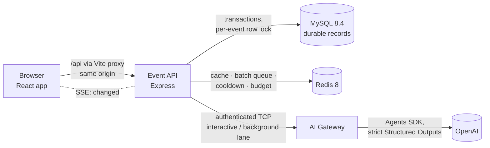

# Event Desk — Plan 6: Hand-in README Implementation Plan

> **For agentic workers:** REQUIRED SUB-SKILL: Use superpowers:subagent-driven-development (recommended) or superpowers:executing-plans to implement this plan task-by-task. Steps use checkbox (`- [ ]`) syntax for tracking.

**Goal:** A root `README.md` that lets a reviewer run, reset and evaluate Event Desk, and that explains the decisions, trade-offs and the limits of its checks, as the brief and T3 §2/§14 require.

**Architecture:** One README in reading order — what it is, quick start, the coordinator flow, commands, configuration, reset (Task 1); how it works, layout, data and API, decisions (Task 2); trust and its limits, security and cost, testing, known limitations, reuse (Task 3). It summarises and links the specs (`docs/specs`) and ADRs (`docs/adr`) instead of repeating them. Every factual claim is checked against the code before commit.

**Tech Stack:** Markdown (GitHub-flavoured, Prettier-formatted), Mermaid diagram.

**Spec:**
- [Project brief](../../project-brief.md) — "Data requirements: document an explicit reset"; "Rules and practical boundaries" (explain trade-offs, explain the limits of your checks, identify what you reused).
- [T3 §2 layout](../../specs/12-architecture-and-repository.md) — `README.md # hand-in: run/reset, env, trade-offs, validation limits, reused boilerplate`; T3 §3 "the README states" one event-api instance; T3 §14 item 6.
- [F1 "Persistence and reset"](../../specs/01-event-and-persistence.md) — document the actual reset command, target database and key namespaces, without secrets.
- [Spec index](../../specs/README.md) — product goal and coordinator flow; decisions D1–D16.

---

## Plan series

| Plan | Scope | Status |
| --- | --- | --- |
| 1, 2, 2B, 3, 3B, 4, 5 | Foundation; event API; web shell; AI Gateway; manual generation; review and save; automatic batches | Done |
| **6 — Hand-in (this plan)** | Root README; spec-index status; small doc fixes | — |

## Before you start

- Branch from `main`: `git switch -c docs/hand-in-readme main`.
- No code changes. No OpenAI calls. `pnpm infra:up` is needed only for the Task 1 quick-start check.

## Global Constraints

- **Accuracy over prose.** Every number, port, command, variable, limit and behaviour stated in the README must match the code on `main`. Each task has a fact-check step; a claim that cannot be verified is removed, not softened.
- **Only document what exists** (AGENTS.md). Every `pnpm <script>` in the README exists in a `package.json`.
- **No secrets.** Never print, quote or describe the contents of `.env`. Use `.env.example` values only, which are local-only defaults.
- **Link, don't duplicate.** Specs and ADRs stay the source of truth; the README summarises in a sentence or a table row and links.
- **Honest limits.** State what the evidence checks prove and what they cannot prove (F3 "Evidence limits", S1). Do not claim prompt injection is prevented.
- **Brief vocabulary.** "Not recorded" is not absence; notes are anonymous and not linked to the roster; the coordinator saves explicitly.
- **Style.** Plain English, short sentences, British spelling as in the brief ("summarise", "behaviour"). Headings in sentence case. Prettier must pass (`pnpm format:check`).
- **Commits.** Conventional subjects (`docs: …`), trailer `Co-Authored-By: Claude Opus 5.5 <noreply@anthropic.com>`.

## Review Focus

1. **A reviewer follows the quick start on a fresh machine.** Every step works in order, and the app opens on E101 with the brief's starting counts. Pinned in Task 1 (fresh-clone run-through).
2. **A reviewer resets after experimenting.** The documented reset refuses while the API runs, says exactly what it deletes, and the next start reseeds. Pinned in Task 1 (reset check).
3. **A reviewer has no OpenAI key.** The README says what works without one (everything but generation) and what the coordinator sees. Pinned in Task 1 (no-key note) and Task 3.
4. **A reviewer checks a claim in the README against the code** (a limit, a port, a rule). The claim is right. Pinned in each task's fact-check step.
5. **A reviewer asks what the AI checks can and cannot guarantee.** The README answers without overclaiming. Pinned in Task 3.

---

## File structure

```text
README.md                         # Tasks 1–3 (new)
docs/specs/README.md              # Task 3: implementation status note
AGENTS.md                         # Task 3: drop the stale "after pulling Plan 3" note
```

---

### Task 1: README — overview, quick start, coordinator flow, commands, configuration, reset

**Files:**
- Create: `README.md`

**Interfaces:**
- Produces: `README.md` sections 1–6, in this order:
  - "Event Desk";
  - "Quick start";
  - "Using it: the coordinator flow";
  - "Commands";
  - "Configuration";
  - "Resetting the data".

  Tasks 2 and 3 append after "Resetting the data".

- [ ] **Step 1: Write `README.md` (sections 1–6)**

````markdown
# Event Desk

A coordinator tool for **Harbour Community Club**. It keeps a reliable attendance record for an ended event and turns short, anonymous feedback notes into an evidence-backed briefing: **what happened, which themes recur, where people disagree, and what might be worth following up.** The coordinator inspects every cited note, edits the wording, and saves it. Saved human work is never overwritten by a new generation.

This build serves one seeded event, **E101 · Saturday Walk**, with four registered members (Alex, Bea, Chris, Drew) and eight supplied notes (F01–F08), as specified in the [project brief](docs/project-brief.md).

| Part | What it is |
| --- | --- |
| `apps/web` | React coordinator app (and a test feedback form) |
| `apps/event-api` | Node.js/Express API: attendance, briefings, generation, batches, live updates |
| `apps/ai-gateway` | The only process that talks to OpenAI; called by the event API over an authenticated local TCP connection |
| MySQL 8.4 · Redis 8 | Durable records · cache, batch queue, cooldown and budget (Docker Compose) |

## Quick start

**You need:** Node.js 24 (see `.nvmrc`), pnpm 11 (`corepack enable` picks the pinned version), Docker with Compose, and — only for AI generation — an OpenAI API key.

```bash
pnpm install
cp .env.example .env          # local-only defaults; add OPENAI_API_KEY to enable generation
pnpm infra:up                 # MySQL 8.4 and Redis 8 on 127.0.0.1
pnpm dev                      # AI Gateway, event API and web app together
```

Open **http://localhost:5173**. It opens E101 with the brief's starting counts: 4 registered · 1 attended · 2 absent · 1 not recorded.

- The first start of the event API creates the schema and seeds E101 once. Later starts keep everything you saved.
- **Without an OpenAI key** everything works except generation: Generate answers "The AI service has no provider configured", and nothing you saved changes.
- **Without the AI Gateway running** Generate answers that the AI service is not reachable; the rest of the app is unaffected.
- The test feedback form is at **http://localhost:5173/events/E101/feedback** (also linked from the Feedback panel as "Open feedback form (test)").

## Using it: the coordinator flow

| The brief's outcome | What to do in the app |
| --- | --- |
| **Record attendance** | Change a member's status. The counts update at once, labelled unsaved; **Save attendance** stores them. A change saved in another tab is detected (you get a conflict, not a silent overwrite). Saved records survive refresh and restart. |
| **Review feedback** | The Feedback panel lists each note with its stable ID (F01…). Notes are read-only and not linked to members. |
| **Generate an AI briefing** | **Generate briefing** calls the model through the AI Gateway and opens the result as a **generated preview** (if the editor has no unsaved text). The briefing answers the four questions: *What happened* (a code-built attendance overview plus a cited feedback summary), *Which themes recur*, *Where people disagree*, *What might be worth following up*. Every item shows its source IDs. |
| **Inspect and edit** | **Read source F05** opens the cited note inline. Edit the wording of any item (structure and references stay fixed), then **Save briefing** — or **Save and replace briefing** when a saved briefing already exists. |
| **Keep work trustworthy** | Save an attendance change and the briefing says **"Out of date — attendance changed since this briefing was generated"**, naming the change ("Chris: Not recorded → Attended"). Generating again creates a separate preview; only an explicit save replaces your saved briefing. Failures are shown in words, and your text is kept. |

**Beyond the brief (confirmed extensions):** new notes can be added through the test feedback form or `pnpm feedback:simulate`. Notes that arrive close together are batched (a fixed 3-second window) into **one** automatic generation, which appears as "New automatic briefing ready to review." and never disturbs your editor or your own Generate. The page updates live; notes from the form or script appear without a reload.

## Commands

| Command | What it does |
| --- | --- |
| `pnpm dev` | AI Gateway (127.0.0.1:4100, TCP), event API (http://127.0.0.1:4000) and web app (http://localhost:5173; Vite proxies `/api` to the API) |
| `pnpm infra:up` / `pnpm infra:down` | Start / stop MySQL and Redis (Docker Compose, loopback ports) |
| `pnpm db:reset` | Explicit reset — see [Resetting the data](#resetting-the-data) |
| `pnpm feedback:simulate` | Posts test notes to the running API: `--count 5 --interval-ms 200 [--text-file notes.txt]`. A burst inside one window makes one automatic briefing (one paid call with a real key) |
| `pnpm verify` | Prettier, ESLint, type-check, architecture rules (dependency-cruiser) and unit tests |
| `pnpm test` | Unit tests only (Vitest) |
| `pnpm test:integration` | Integration tests against the `event_desk_test` database and Redis DB 1 (needs `pnpm infra:up`) |
| `pnpm e2e` | Playwright end-to-end tests on their own ports with a scripted fake AI Gateway (needs `pnpm infra:up` and `pnpm --filter @event-desk/e2e exec playwright install chromium`); don't run it at the same time as the integration tests |
| `pnpm smoke:live` | Manual real-model check through the running Gateway (needs a key); `--hostile` adds a prompt-injection note. Never run in CI |
| `pnpm build` | Compiles the Node packages and builds the web bundle |

## Configuration

All settings come from environment variables. `.env.example` lists every one with local-only defaults; copy it to `.env`. Each app reads **only its own** keys from `.env`, so the event API never sees the OpenAI key. Invalid values stop the app at startup with a message naming the variable.

| Variable | Default | Used by | Meaning |
| --- | --- | --- | --- |
| `OPENAI_API_KEY` | (empty) | Gateway | Enables generation. Empty → Generate answers "no provider configured" |
| `OPENAI_MODEL` | `gpt-5-mini` | Gateway | Model with strict Structured Outputs |
| `GATEWAY_SERVICE_SECRET` | local-only value | API, Gateway | Shared secret for the internal TCP calls (≥ 32 bytes; generate one with `openssl rand -hex 32` for anything beyond your machine) |
| `MYSQL_URL` / `REDIS_URL` | local Compose services | API | Durable store / cache, queue and limits |
| `PORT` / `GATEWAY_PORT` | `4000` / `4100` | API / both | Loopback ports |
| `ALLOWED_ORIGINS` / `ALLOWED_HOSTS` | `http://localhost:5173` / `localhost,127.0.0.1,[::1]` | API | Same-origin protection for every request |
| `BRIEFING_BATCH_WINDOW_MS` | `3000` | API | Fixed batch window for automatic briefings |
| `GENERATION_DAILY_ATTEMPT_LIMIT` / `GENERATION_BATCH_DAILY_LIMIT` | `20` / `15` | API | Daily paid-attempt budget, and the share automatic batches may use |
| `MANUAL_GENERATION_TIMEOUT_MS` | `60000` | API | Deadline of one Generate (max 85 s; the browser waits 90 s) |
| `FEEDBACK_SUBMISSION_ENABLED` / `FEEDBACK_MAX_NOTES_PER_EVENT` | `true` / `100` | API | The test feedback channel and its note limit |
| `GATEWAY_DAILY_CALL_LIMIT` | `40` | Gateway | Independent in-memory daily backstop on provider calls |

The remaining variables (timeouts, cache TTL, log level, token limit) are documented inline in `.env.example`.

## Resetting the data

Saved work survives restarts on purpose; resetting is a deliberate developer step.

```bash
# 1. Stop pnpm dev (the event API and the AI Gateway).
pnpm db:reset
# 3. Start again: the event API recreates the schema and reseeds E101 with F01–F08.
pnpm dev
```

`pnpm db:reset`:
- **refuses to run while the event API answers** on its health check, so no save or returning generation can race it;
- drops and recreates the application database **`event_desk`** — saved attendance, saved briefings, previews, generation snapshots, outcomes and added notes are all removed;
- deletes only this application's Redis keys: **`event-desk:*`** (cache, cooldown, budget) and **`bull:briefing-batch:*`** (the batch queue). It never runs `FLUSHALL` and never touches other databases;
- reads its targets from `.env` and prints what it removed, without printing connection secrets.

Reload the browser after a reset.
````

- [ ] **Step 2: Fact-check every claim**

Check each against the code, and fix the README where it differs. Record each check in the task report, one line each:
- Node 24: `.nvmrc`; `engines` in root `package.json`. pnpm 11: `packageManager`.
- Ports and hosts: `apps/event-api/src/config/env.ts`, `apps/ai-gateway/src/config/env.ts`, `apps/web/vite.config.ts`, `docker-compose.yml`.
- Seed once and keep saved work: `apps/event-api/src/persistence/store-bootstrap.ts`, `seed.ts`.
- The exact error texts quoted: "no provider configured" and "not reachable" in `modules/generation/gateway-failure.ts`.
- UI strings quoted in the flow table: "Save attendance", "Generate briefing", "Read source F05", "Save briefing", "Save and replace briefing", "Out of date — attendance changed since this briefing was generated", "Chris: Not recorded → Attended", "New automatic briefing ready to review.", "Open feedback form (test)". Use `grep -rn` in `apps/web/src`.
- Every command: the scripts exist in the root `package.json`. Run:

  ```bash
  node -e 'const s=require("./package.json").scripts; for (const c of ["dev","infra:up","infra:down","db:reset","feedback:simulate","verify","test","test:integration","e2e","smoke:live","build"]) if(!s[c]) {console.error("missing",c); process.exitCode=1}'
  ```

- Every variable and default: `.env.example` and both `env.ts` schemas, including that `MANUAL_GENERATION_TIMEOUT_MS` max is 85000 and the web timeout is 90 s (`apps/web/src/data/api/event-api.ts`).
- "Each app reads only its own keys": `loadDotEnv` in both apps.
- Reset behaviour: `apps/event-api/src/scripts/reset.ts`, `reset-store.ts` (refusal, database name check, key prefixes, printed report).

- [ ] **Step 3: Quick-start and reset run-through**

In a scratch clone, so the working copy is untouched: `git clone . "$TMPDIR/event-desk-qs" && cd "$TMPDIR/event-desk-qs"`.
1. Follow the quick start exactly, with `cp .env.example .env`, no OpenAI key, and the shared Compose services already running (`pnpm infra:up` from the clone is fine; same project name).
2. With `pnpm dev` running, check:
   - `curl -s http://127.0.0.1:4000/api/health`;
   - `curl -s http://127.0.0.1:4000/api/events/E101` shows counts 4/1/2/1 (or the current saved data if `event_desk` already holds edits — note which);
   - the web app loads at http://localhost:5173 in the browser pane or with `curl -s http://localhost:5173 | head -5`;
   - Generate without a key answers PROVIDER_NOT_CONFIGURED (`curl -s -X POST -H 'Origin: http://localhost:5173' -H 'Content-Type: application/json' -d '{"baseAttendanceRevision":0}' http://127.0.0.1:4000/api/events/E101/briefing-generations`; use the current revision).
3. Run `pnpm db:reset` while `pnpm dev` runs: it must refuse. Stop `pnpm dev`.
4. **Never run `pnpm db:reset` successfully against `event_desk`.** It holds the user's working data. The refusal in item 3 plus the code check in Step 2 are the reset check; the reset itself is covered by `reset-store.int.test.ts`.
5. Stop everything and delete the scratch clone. Ports 4000, 4100 and 5173 must be free afterwards.

Record what each check printed (no secrets) in the task report. Fix any README step that did not work as written.

- [ ] **Step 4: Format and commit**

Run: `pnpm format && pnpm format:check`
Expected: exit 0.

```bash
git add README.md
git commit -m "docs: README — overview, quick start, coordinator flow, commands, configuration and reset" -m "Co-Authored-By: Claude Opus 5.5 <noreply@anthropic.com>"
```

---

### Task 2: README — how it works, repository layout, data and API, decisions and trade-offs

**Files:**
- Modify: `README.md` (append after "Resetting the data")

**Interfaces:**
- Consumes: Task 1's README.
- Produces: sections 7–10, in this order:
  - "How it works";
  - "Repository layout";
  - "Data and API";
  - "Decisions and trade-offs".

- [ ] **Step 1: Append sections 7–10**

````markdown
## How it works



- **The event API owns the facts.** Attendance counts are calculated in code from saved records, never by the model and never stored. Every write runs in one MySQL transaction that locks the event row first. Side effects (cache flush, live-update message) run only after commit.
- **Generation has two triggers and one pipeline.**
  - **Generate** is synchronous. The API captures the saved attendance and notes, calls the Gateway on the *interactive* lane, validates the result against that captured input, and stores it as a new preview.
  - **New notes** (test form or script) are batched by a BullMQ job: one job per fixed window, with the window's cutoff never moving. The job reads all notes when it runs, skips when nothing changed, uses the *background* lane, and retries only known temporary failures (at most 3 attempts in 5 minutes).
  - Both use the same capture → call → validate → commit code, so the rules exist once.
- **The coordinator always wins.** Manual calls have their own Gateway lane and a reserved share of the daily budget. A batch waits for a running Generate and then usually skips. An automatic result never replaces an unreviewed manual one.
- **The AI Gateway is the only process with the OpenAI key.**
  - It holds fixed instructions; the notes travel in a separate data message.
  - It uses strict Structured Outputs, no tools, retries off and tracing off.
  - It enforces deadlines, one call per lane and a daily backstop.
  - The event API reaches it over loopback TCP with a shared secret, and never calls OpenAI itself.
- **Three briefing slots keep human work safe:**
  - the **saved briefing**, changed only by your explicit save;
  - the **selected preview**, the one you are editing;
  - the **incoming preview**, the newest candidate waiting for review.

  Generation only ever writes the incoming slot.
- **Freshness is a comparison, not a flag.** Each generation stores the attendance and note set it read. A briefing is out of date when the saved records differ from that snapshot, and current again if an attendance change is reverted. Saving edited text never clears it.
- **Live updates.** Every committed change flushes the versioned Redis cache of the event read and sends an SSE `changed` message. The page re-reads the event, and polls when the stream is down.
- **One event-API process.** Single-flight Generate, the live-update notifier and the cache-bypass flag are in-process by design (T3 §3); run one instance.

## Repository layout

```text
apps/
  web/           React 19 + Vite: features/ (attendance, feedback, briefing, feedback-form), data/ (API, queries, mutations), state/ (Zustand UI state)
  event-api/     Express: modules/ (services + pure domain rules), ports/, repositories/ (TypeORM), integrations/ (Redis, BullMQ, Gateway client), persistence/ (schema, seed)
  ai-gateway/    TCP server: operations/, ai/ (prompt, OpenAI adapter), limits/
packages/
  contracts/     Zod schemas shared by every boundary (HTTP, TCP, stored rows, model output)
  tcp-rpc/       Length-prefixed JSON over TCP with authentication and loopback-only binding
e2e/             Playwright specs and a scripted fake Gateway
docs/            Brief, specs (F1–F8, S1, T1–T5), ADRs, build plans, reviews
```

Architecture rules are enforced in CI by dependency-cruiser:
- services depend on ports, never adapters;
- domain folders are pure;
- `typeorm` stays in persistence and repositories, and `bullmq`/`ioredis` in integrations;
- `openai` stays in the Gateway's `ai/` folder;
- the web app's UI never calls HTTP directly.

## Data and API

**Data** (MySQL, normalised; [T4](docs/specs/13-data-model-and-transactions.md)):
- events, members and anonymous feedback notes, with no link between notes and members;
- immutable generations with their captured attendance and note inputs, items and cited sources;
- the two preview slots;
- the saved briefing, which stores only human wording per item.

Composite foreign keys make the database itself reject a citation of a note outside a generation's input, and a saved text that points at another generation's items.

**API** (JSON; same-origin; [T3 §5](docs/specs/12-architecture-and-repository.md)):

| Method and path | Purpose |
| --- | --- |
| `GET /api/health` | MySQL and Redis status |
| `GET /api/events/E101` | The whole event view: members, counts, notes, the three briefing slots with freshness, generation status |
| `PUT /api/events/E101/attendance` | Save attendance (`baseAttendanceRevision` detects a save from another tab) |
| `POST /api/events/E101/briefing-generations` | Generate (synchronous) |
| `POST /api/events/E101/briefing-preview/select` | Open the incoming preview for editing |
| `PUT /api/events/E101/briefing` | Save the briefing's wording (text only; references come from the server) |
| `POST /api/events/E101/feedback` | Test channel: add a note (idempotent per `submissionId`) |
| `GET /api/events/E101/changes` | Server-Sent Events: `changed` after every committed change |

Errors are one JSON shape, `{ error: { code, message, field?, retryAfterMs? } }`, with one status per code.

## Decisions and trade-offs

Each decision has a short record in [`docs/adr`](docs/adr/README.md) (context, options, consequences) and its full design in [`docs/specs`](docs/specs/README.md).

| Decision | Choice | Trade-off |
| --- | --- | --- |
| Safe regeneration ([ADR 0002](docs/adr/0002-separate-preview-for-regeneration.md)) | A new generation is a separate preview; only an explicit save replaces the saved briefing | More slots and states than a confirm-before-overwrite dialog, but human work cannot be lost by a click elsewhere |
| Text-only edits ([0003](docs/adr/0003-text-only-briefing-edits.md)) | You edit wording; items, order and references stay as generated | You cannot add, remove or re-cite items; in exchange, every saved item keeps verifiable sources |
| Store ([0004](docs/adr/0004-mysql-and-typeorm.md), [0016](docs/adr/0016-normalised-schema-with-composite-keys.md)) | MySQL with a normalised schema and composite keys | More tables than JSON documents, but the database enforces the evidence rules |
| AI boundary ([0005](docs/adr/0005-openai-agents-sdk-in-gateway.md), [0009](docs/adr/0009-internal-ai-gateway-over-tcp.md)) | A separate Gateway process, the only holder of the key, reached over authenticated local TCP | One more process and its failure modes (handled as "AI service not reachable") |
| Freshness ([0006](docs/adr/0006-freshness-by-snapshot-comparison.md)) | Compare the stored snapshot with saved records | Stores per-generation inputs; gives exact "what changed" messages and clears itself after a revert |
| Triggers and priority ([0007](docs/adr/0007-generation-triggers.md), [0010](docs/adr/0010-manual-priority-and-fixed-windows.md)) | Generate is synchronous; new notes batch in a fixed 3 s window | A fixed window is simpler and bounded, but a note just after a cutoff waits for the next window |
| Batch queue ([0008](docs/adr/0008-bullmq-batch-queue.md)) | BullMQ with throttle de-duplication and delay | Adds Redis as a dependency for batches (verified first in a spike); behind a port, so it could be swapped |
| Conflicts ([0013](docs/adr/0013-conflicts-cite-two-notes.md)) | A conflict cites at least one note per side | Enforces that both sides stay visible; a single note with an internal contradiction cannot be a conflict |
| Retry ([0014](docs/adr/0014-retry-is-generate-again.md)) | Retry is Generate again, confirmed first when the last attempt may have been charged | No hidden retries on the coordinator's path; the coordinator decides on every paid attempt |
| Live updates ([0015](docs/adr/0015-server-sent-events.md)) | Server-Sent Events with polling fallback | One long-lived connection per open tab (see Known limitations) |
| Four questions ([0017](docs/adr/0017-briefing-answers-four-questions.md)) | "What happened" = code-built attendance overview + a cited model summary | The model never writes the counts |
| Cache ([0018](docs/adr/0018-versioned-event-view-cache.md)) | Versioned Redis cache of the event read | A version counter instead of a plain delete closes a stale-write race; reads fall back to MySQL when Redis is down |
| Frontend and backend stacks ([0011](docs/adr/0011-frontend-stack.md), [0012](docs/adr/0012-backend-stack-and-workspace.md)) | React + Vite + React Query + React Hook Form + Zustand + Astryx; Express + TypeORM + Zod; one pnpm workspace | Familiar, well-supported libraries over novelty; shared Zod contracts remove hand-written duplicate types |
````

- [ ] **Step 2: Fact-check every claim**

Check each against the code and specs, and fix the README where it differs. Record each check in the task report:
- **Lanes, lock order, after-commit effects:**
  - `briefing-generation-service.ts`;
  - `typeorm-unit-of-work.ts`;
  - `contracts/src/gateway-rpc` (`GATEWAY_LANES`).
- **Batching:**
  - the fixed window comes from `integrations/bullmq-briefing-batch-queue.ts` (dedup `ttl`, `delay`);
  - "skips when nothing changed" from `domain/same-input.ts`;
  - "3 attempts in 5 minutes" from `domain/batch-jobs.ts`;
  - retryable codes from `domain/batch-retry-policy.ts`.
- **Priority:**
  - `whenIdle` in the processor;
  - `decideIncoming` in `domain/incoming-slot-rules.ts`;
  - the budget split in `integrations/redis-generation-limits.ts`.
- **Gateway settings:** `apps/ai-gateway/src/ai/*` (`store: false`, no tools, `maxTurns: 1`, retries 0, tracing disabled), `limits/lane-gate.ts`, `limits/usage-backstop.ts`.
- **Slots and freshness:** `contracts/src/freshness.ts` (a revert matches again), `preview_slots` in the migration.
- **Live updates:** `modules/changes/*`, `apps/web/src/data/queries/use-event-changes.ts`.
- **Layout:** `ls apps/*/src packages/*/src`. Every folder named exists.
- **Architecture rules:** `.dependency-cruiser.cjs` rule names.
- **API table:** every route exists (`grep -rn "router\.\(get\|post\|put\)" apps/event-api/src`). The error shape comes from `contracts/src/api/errors.ts`.
- **ADR links:** every linked file exists. Check with `ls docs/adr`, and every relative link with `grep -o '](docs/[^)]*)' README.md`.

- [ ] **Step 3: Format and commit**

Run: `pnpm format && pnpm format:check`
Expected: exit 0. Also check the Mermaid block renders: no syntax errors, and node labels with `<br/>` are quoted or plain.

```bash
git add README.md
git commit -m "docs: README — how it works, layout, data and API, decisions and trade-offs" -m "Co-Authored-By: Claude Opus 5.5 <noreply@anthropic.com>"
```

---

### Task 3: README — trust and its limits, security and cost, testing, known limitations, reuse; spec-index status

**Files:**
- Modify: `README.md` (append), `docs/specs/README.md` (status note), `AGENTS.md` (one stale phrase)

**Interfaces:**
- Consumes: Tasks 1–2's README.
- Produces: sections 11–15, in this order:
  - "What the checks prove — and what they don't";
  - "Security and cost controls";
  - "Testing";
  - "Known limitations";
  - "What was reused".

- [ ] **Step 1: Append sections 11–15**

````markdown
## What the checks prove — and what they don't

**Proven by code and the database, for every stored briefing:**
- Every cited ID is a real note that was in the input this generation read. The backend validates it, and a composite foreign key rejects anything else. A model that cites F99, or a note added later, has its whole candidate rejected; nothing partial is stored.
- **Section rules.** A theme cites at least two different notes, and so does a conflict (one per side). A suggestion cites at least one note. The feedback summary cites one to eight. Sections have at most 10 items and items at most 8 sources. Text lengths are bounded.
- Counts and the attendance overview come from saved records in code. The model cannot change attendance or invent reasons for absence: it has no tools and no write path.
- **Edits stay text-only.** A save cannot add or remove items, change references or alter provenance. The request schema has no field for them, and the database stores no references with the saved text.
- **Freshness is reported, never guessed.** It comes from comparing the stored snapshot with saved records.

**Not proven, so the coordinator reviews:**
- **That the cited notes support the wording.** Two valid IDs can still sit under an unsupported claim. The app says so beside every briefing: *"References identify the source notes; they do not automatically prove that the wording is supported. Review the notes before saving."*
- **That the wording follows the anonymity rules.** These are rules such as "one note asks…", never "some attendees"; "two notes", never "several". They are prompt instructions plus human review. `pnpm smoke:live` adds a wording check as an aid, not a guarantee.
- **That prompt injection is impossible.** Notes travel as data in a separate message, the model has no tools, and output is schema-checked and rendered as plain text. These reduce the risk; they do not remove it ([S1](docs/specs/08-openai-security.md)).

## Security and cost controls

- **Secrets:**
  - Only the AI Gateway reads `OPENAI_API_KEY`; the event API copies only its own variables from `.env`.
  - No secret reaches the browser, the logs or the repository.
  - Logs carry IDs, codes and timings, never note text or model output.
- **Local only.** Every service binds to loopback. The API accepts only configured hosts and origins, and requires JSON for every change. Cross-origin writes, including feedback submission, are rejected.
- **Feedback is untrusted input everywhere.** It is rendered as plain text and never interpolated into instructions. Submitted notes are limited to 1,000 characters each, 100 per event and 32 KiB in total; nothing is ever truncated.
- **Cost:**
  - Each paid attempt counts against a daily budget of 20, persisted in Redis per UTC day, of which automatic batches may use at most 15. Only an attempt the provider never received is given back.
  - A provider rate limit starts a shared cooldown that survives restarts. Generate during it answers "try again in N seconds".
  - The Gateway has its own daily backstop (40 calls).
  - SDK and transport retries are off; only the batch queue retries, and only known temporary failures.
  - A call that may have reached the provider is never replayed automatically. Retry asks first.

## Testing

| Suite | Command | What it covers |
| --- | --- | --- |
| Unit | `pnpm test` (part of `pnpm verify`) | Domain rules: counts, freshness, evidence validation, text edits, retry policy, window and status mapping. Services with fakes. Gateway prompt and adapters. Web components and hooks, with MSW standing in for the API. |
| Integration | `pnpm test:integration` | The event API against real MySQL and Redis with a fake Gateway: transactions, conflicts, the cache, feedback submission, batches (fixed windows, superseding, coordinator priority, retries, budget), live updates, reset |
| End to end | `pnpm e2e` | Chromium against the real web app and API, with a scripted Gateway. It walks the spec's example (edit, save, change attendance, regenerate, replace) and follows feedback-form notes to one automatic briefing. |
| Live model | `pnpm smoke:live [--hostile]` | Manual, paid: the real model on the supplied notes, with and without an injection note; prints the evidence and wording check |

CI (GitHub Actions) runs the first three on every push and pull request. It never calls the real model.

## Known limitations

- **One coordinator, one event, local only.** There is no authentication, event creation or deployment, as the brief allows. The feedback form and script are a test channel standing in for the club's real form.
- **Run one event-API process.** Single-flight Generate, the live-update notifier and the cache-bypass flag live in memory.
- **Six or more open tabs** can hit the browser's limit of about six connections per site over HTTP/1.1, because each tab holds one live-update stream. Close spare tabs if the page stops loading.
- **Model wording varies between runs.** In live checks with the current prompt (`briefing.v6`), the evidence rules passed. The model still sometimes wrote "participants" in a suggestion, or added a "no follow-up needed" suggestion for a note without one. Review before saving; the wording rules are not machine-enforced.
- **Rare crash paths end visibly, never with a replayed call.** In both cases the run is recorded as failed, and the coordinator can generate again:
  - A batch job interrupted twice (two crashes or shutdowns while it waits) is recorded as failed (`INTERNAL`) when the next instance starts.
  - A batch whose dispatch marker could not be cleared after a temporary failure ends as "outcome unknown" instead of retrying.
- **The automatic batch window is fixed.** A note that arrives just after a cutoff waits for the next window, by design.

## What was reused

**No starter repository, template or personal boilerplate.** The workspace was built from scratch for this assignment.

**Libraries:** React, Vite, TanStack Query, React Hook Form, Zustand, React Router, Axios, the Astryx design system, Express, TypeORM with mysql2, ioredis, BullMQ, Zod, pino, the OpenAI Agents SDK and Vitest, Testing Library, MSW and Playwright. Exact versions are pinned in each `package.json` and `pnpm-lock.yaml`.

**How it was built:** the specs in `docs/specs` were written and confirmed first, with every decision recorded as an ADR. The work was then implemented plan by plan (`docs/superpowers/plans`), with AI coding assistance (Claude Code). Every change went through tests, an independent review and a final whole-branch review before merging.
````

The user chose (2026-10-04) to keep the "How it was built" paragraph.

- [ ] **Step 2: Spec-index status and AGENTS.md**

`docs/specs/README.md`:
1. After the first "Status:" paragraph, add: `Implementation: Plans 1–5 (docs/superpowers/plans) are complete and merged (2026-10-04); the hand-in README at the repository root explains how to run, reset and evaluate the build.`
2. In "## Decisions", the paragraph beginning "All decisions are confirmed. Implementation starts with…" ends with "No implementation plan or application code is part of this documentation pass. CodeGraph initialisation is deferred by user choice and is not required for this documentation review." Replace those last two sentences with: "The implementation followed in Plans 1–5."

`AGENTS.md` commands table, `cp .env.example .env` row: remove the stale clause "; re-copy, or add the AI Gateway block, after pulling Plan 3". Keep "First-time local configuration (local-only defaults for Docker Compose)".

- [ ] **Step 3: Fact-check every claim**

Check each against the code, and fix the README where it differs. Record each check in the task report:
- **Evidence rules:**
  - section minimums in `contracts/src/briefing-rules.ts` (`MIN_DISTINCT_SOURCES`);
  - limits in `contracts/src/briefing-content.ts` (`SECTION_LIMITS`, `TEXT_LIMITS`);
  - the summary's 1–8 citations: summary minimum 1, `sourcesPerItem` 8;
  - the composite FK `fk_source_input` in the migration;
  - "nothing partial stored" in the generation service's validate-then-commit.
- **Text-only saves:** `SaveBriefingRequestSchema` (strict) and the `saved_briefing_items` columns.
- **The evidence notice text:** grep `apps/web/src` for "References identify the source notes".
- **Security:**
  - `loadDotEnv` allowlists in both apps;
  - host/origin guards and `require-json` in `http/middleware`;
  - feedback limits in `modules/feedback/domain/feedback-limits.ts` and the env defaults;
  - logging (`apps/*/src/shared/logger.ts` redaction, and no note text in log calls: grep `logger\.(info|warn|error)` in the generation and feedback modules).
- **Cost:**
  - budget and cooldown in `redis-generation-limits.ts` and env defaults;
  - the Gateway backstop default;
  - SDK retries off in `apps/ai-gateway/src/ai/openai-client.ts`;
  - "only known temporary failures" in `isRetryableGatewayFailure`.
- **Testing:**
  - the CI jobs in `.github/workflows/ci.yml` (job names and commands);
  - the Playwright spec names in `e2e/tests`.
- **Known limitations:** the parked-stall and dispatch-marker behaviour (comments in `integrations/bullmq-briefing-batch-queue.ts` and `briefing-generation-service.ts`), and `PROMPT_VERSION`.
- **Libraries:** each listed library appears in a `package.json` (`grep -h '"<name>"' apps/*/package.json packages/*/package.json e2e/package.json package.json`). Remove any that do not; add none that are not used.

- [ ] **Step 4: Final read-through and commit**

Read the whole README once, top to bottom, as a reviewer who has never seen the project:
- every section answers its heading;
- no internal jargon is left unexplained (spec IDs only as links);
- links resolve;
- Prettier passes.

Run: `pnpm format && pnpm format:check && pnpm verify`
Expected: exit 0. The docs change nothing in code, but verify proves the formatting gate.

```bash
git add README.md docs/specs/README.md AGENTS.md
git commit -m "docs: README — what the checks prove, security and cost, testing, limitations, reuse; spec-index status" -m "Co-Authored-By: Claude Opus 5.5 <noreply@anthropic.com>"
```
